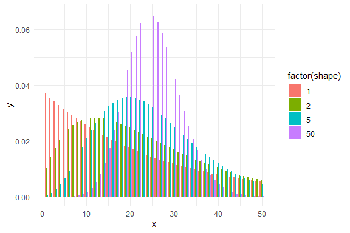
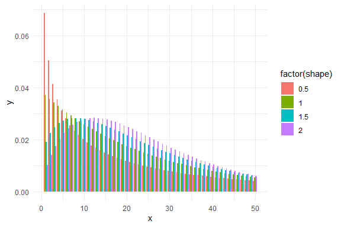

Negative Binomial Distributions
================
Curtis C. Bohlen, Casco Bay Estuary Partnership


# Introduction

This is a quick notebook to look at the impact of different parameters
on the shape of the negative binominal distribution.

The negative binomial is invoked in R with the function:

`dnbinom(x, size, prob, mu, log = FALSE)`

Classically, the negative binomial is developed as the number of
Bernoullli trials before reaching a certain number of successes.

It is more often often parameterized so the response is the number of
*failures* before a certain number of successes. According the the help
pages for `dnbinom()` and friends, R uses this second convention.

> This represents the number of failures which occur in a sequence of
> Bernoulli trials before a target number of successes is reached. The
> mean is μ = n(1-p)/p and variance n(1-p)/p^2.
>
> A negative binomial distribution can also arise as a mixture of
> Poisson distributions with mean distributed as a gamma distribution
> (see pgamma) with scale parameter (1 - prob)/prob and shape parameter
> size. (This definition allows non-integer values of size.)
>
> An alternative parametrization (often used in ecology) is by the mean
> mu (see above), and size, the dispersion parameter, where prob =
> size/(size+mu). The variance is mu + mu^2/size in this
> parametrization.

It appears what is meant is that size = n (number of successes) and prob
= p (probability of success on any one trial.)

(Confusingly, in some fields, and thus in some references (including
Wikipedia) the role of “successes” and “failures” is reversed, thus the
distribution is thought of as the number of trials until the nth
failure. This only swaps the roles of p and (1-p) in any related
formulae.)

GAM and GLM models in R use the alternative parameterization in terms of
the mean and a “shape” parameter (which equals the `size` parameter).
Some authors prefer a “shape” parameter that is the inverse of this one,
and that convention is used in many other statistical packages.

``` r
library(tidyverse)
#> -- Attaching packages --------------------------------------- tidyverse 1.3.1 --
#> v ggplot2 3.3.5     v purrr   0.3.4
#> v tibble  3.1.6     v dplyr   1.0.7
#> v tidyr   1.1.4     v stringr 1.4.0
#> v readr   2.1.1     v forcats 0.5.1
#> -- Conflicts ------------------------------------------ tidyverse_conflicts() --
#> x dplyr::filter() masks stats::filter()
#> x dplyr::lag()    masks stats::lag()

theme_set(theme_minimal())
```

# Shape of the Distribution

I generate distributions with the same mean, but different shape
parameters, to give a sense of the “shape” of the errors you might
expect to have to model if you are using a negative binomial model.
These are all based on the idea that you have a mean abundance of a
plankton species around 25.

``` r
the_dat <- tibble(x = rep(1:50,4), 
                  shape = rep(c(1,2,5, 50), each = 50) ) %>%
  mutate(y = dnbinom(x, size = shape, mu = 25))

ggplot(the_dat, aes(x = x, y = y, fill = factor(shape))) +
  geom_col(position = 'dodge')
```



Under this parameterization, a larger shape parameter moves you closer
and closer towards a Poisson distribution. While a smaller shape
parameter makes the distribution look more and more like a (discrete)
gamma distribution, thus with heavy tail. Recall that a Poisson
distribution with a large expected count, `np` looks close to normally
distributed, which is what we see here with the high “shape” parameters.

In our fitted models so far, the negative binomial family function in
`gam()`, (we used `nb()`) calls the shape / size parameter “theta” for
some reason.

Looking closer at parameter values around what we observed with the
Acartia data

``` r
the_dat <- tibble(x = rep(1:50,4), 
                  shape = rep(c(0.5, 1, 1.5, 2), each = 50) ) %>%
  mutate(y = dnbinom(x, size = shape, mu = 25))

ggplot(the_dat, aes(x = x, y = y, fill = factor(shape))) +
  geom_col(position = 'dodge')
```


