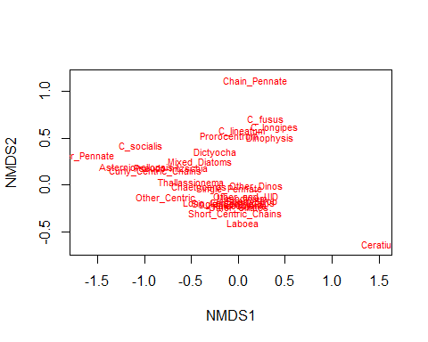
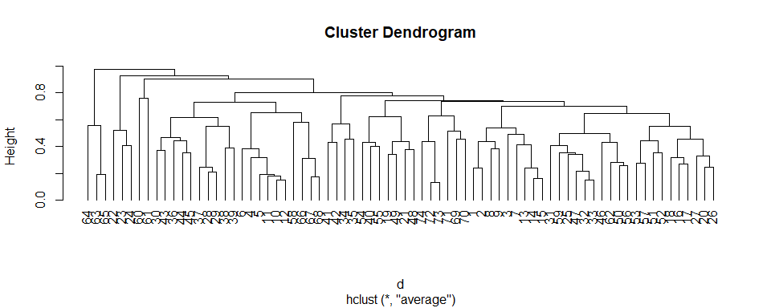
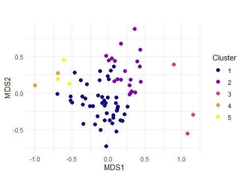
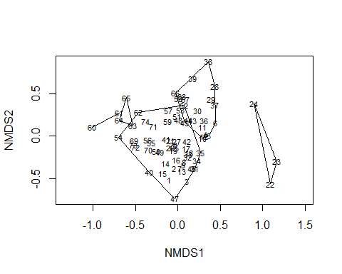
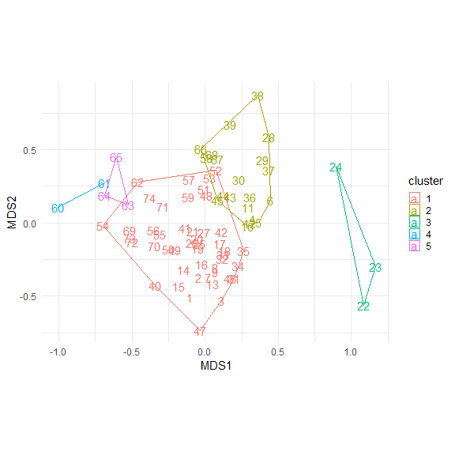
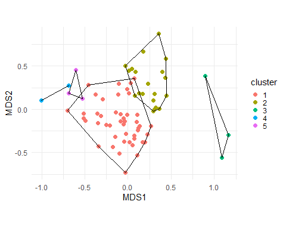

Examining Zooplankton Data File
================
Curtis C. Bohlen, Casco Bay Estuary Partnership

-   [Load Libraries](#load-libraries)
-   [Load Data](#load-data)
    -   [Reorder columns by mean count](#reorder-columns-by-mean-count)
    -   [Default 2-D NMDS](#default-2-d-nmds)
-   [Cluster Analysis](#cluster-analysis)
    -   [Plot Clusters](#plot-clusters)
-   [Finer Control of Graphics](#finer-control-of-graphics)
    -   [Understanding `ordihull()`](#understanding-ordihull)
    -   [Plot Clusters and Convex
        Hulls](#plot-clusters-and-convex-hulls)


\#Introduction In this notebook, I am taking a first stab at
phytoplankton community analysis. We look principally at Non-metric
multidimensional scaling and cluster analysis. We rely on the `vegan`
package for most of the underlying tools

# Load Libraries

``` r
library(tidyverse)
#> -- Attaching packages --------------------------------------- tidyverse 1.3.1 --
#> v ggplot2 3.3.5     v purrr   0.3.4
#> v tibble  3.1.6     v dplyr   1.0.7
#> v tidyr   1.1.4     v stringr 1.4.0
#> v readr   2.1.1     v forcats 0.5.1
#> -- Conflicts ------------------------------------------ tidyverse_conflicts() --
#> x dplyr::filter() masks stats::filter()
#> x dplyr::lag()    masks stats::lag()
library(readxl)

library(vegan)
#> Loading required package: permute
#> Loading required package: lattice
#> This is vegan 2.5-7

theme_set(theme_minimal())
```

# Load Data

``` r
fn <- 'SEANET_Phyto Data_Bigelow.xlsx'

phyto_community <- read_excel(fn, sheet = "FCAM FCM", skip = 59) %>%
  rename_with(.fn = ~sub(" \\(.*", "", .x) ) %>%
  rename_with(.fn = ~sub("FCM ", "", .x) ) %>%
  rename_with(.fn = ~sub("Vol", "", .x) ) %>%
  rename_with(.fn = ~sub(" *$", "", .x) ) %>%
  rename_with(.fn = ~gsub(" ", "_", .x)) %>%
  rename_with(.fn = ~gsub("\\.", "", .x)) %>%
  select(1:30)
```

### Reorder columns by mean count

We look at the number of samples containing each species. The last 7
taxon groups could be considered “rare”.

``` r
my_order <- phyto_community %>%
  summarize(across(c(-1), function(x) sum(x>0))) %>%
  unlist 
my_order
#>        Mixed_Diatoms        Other_Centric Short_Centric_Chains 
#>                   30                    7                   74 
#>  Long_Centric_Chains Curly_Centric_Chains       Single_Centric 
#>                   72                   24                   74 
#>          Chaetoceros           C_socialis         Rhizosolenia 
#>                   54                   21                   37 
#>           Mediopyxis        Other_Pennate       Single_Pennate 
#>                   37                    2                   70 
#>        Chain_Pennate       Thallassionema     Pseudo-nitzschia 
#>                    7                   50                   31 
#>    Asternionellopsis          Other_Dinos           Dinophysis 
#>                   28                   72                   43 
#>             Ceratium           C_longipes           C_lineatum 
#>                    6                   40                   40 
#>              C_fusus         Prorocentrum       Other_Ciliates 
#>                   33                   50                   68 
#>          Strom-Strob           Mesodinium               Laboea 
#>                   70                   72                   35 
#>            Dictyocha        Other_and_UID 
#>                   43                   74

my_order <- my_order %>%
  sort(decreasing = TRUE) %>%
  names
```

``` r
phyto_community <- phyto_community %>%
  select(Sample_ID, all_of(my_order))
phyto_community
#> # A tibble: 74 x 30
#>    Sample_ID     Short_Centric_Ch~ Single_Centric Other_and_UID Long_Centric_Ch~
#>    <chr>                     <dbl>          <dbl>         <dbl>            <dbl>
#>  1 SNT_2016-04-~        515404126.     393521177.     30094751.        48084658.
#>  2 SNT_2016-04-~        792749612.     423227030.     83551618.       273230718.
#>  3 SNT_2016-04-~        289489421.     140231480.     45049729.        86272835.
#>  4 SNT_2016-04-~         12372311.     125908023.     39174297.        16583335.
#>  5 SNT_2016-04-~          4477018.      92164596.     49913765.         2953400.
#>  6 SNT_2016-04-~          7159346.      23733969.     50650455.          208803.
#>  7 SNT_2016-05-~        289374805.      42191647.     53694682.        66354278.
#>  8 SNT_2016-05-~        498014917.      51250846.     90593710.       478476268.
#>  9 SNT_2016-05-~        338594890.     104263061.     90881112.       164137335.
#> 10 SNT_2016-05-~         35047615.      10166343.     81562247.        12258280.
#> # ... with 64 more rows, and 25 more variables: Other_Dinos <dbl>,
#> #   Mesodinium <dbl>, Single_Pennate <dbl>, Strom-Strob <dbl>,
#> #   Other_Ciliates <dbl>, Chaetoceros <dbl>, Thallassionema <dbl>,
#> #   Prorocentrum <dbl>, Dinophysis <dbl>, Dictyocha <dbl>, C_longipes <dbl>,
#> #   C_lineatum <dbl>, Rhizosolenia <dbl>, Mediopyxis <dbl>, Laboea <dbl>,
#> #   C_fusus <dbl>, Pseudo-nitzschia <dbl>, Mixed_Diatoms <dbl>,
#> #   Asternionellopsis <dbl>, Curly_Centric_Chains <dbl>, C_socialis <dbl>, ...
```

## Default 2-D NMDS

``` r
NMDS_default <- metaMDS(phyto_community[,-1], k = 2, autotransform = TRUE,
                        maxit = 50, trymax = 50)
#> Square root transformation
#> Wisconsin double standardization
#> Run 0 stress 0.1876025 
#> Run 1 stress 0.2001175 
#> Run 2 stress 0.1876051 
#> ... Procrustes: rmse 0.0005229086  max resid 0.002818739 
#> ... Similar to previous best
#> Run 3 stress 0.1996608 
#> Run 4 stress 0.2023717 
#> Run 5 stress 0.1935386 
#> Run 6 stress 0.2002953 
#> Run 7 stress 0.2362711 
#> Run 8 stress 0.1878978 
#> ... Procrustes: rmse 0.004244653  max resid 0.02840747 
#> Run 9 stress 0.2401901 
#> Run 10 stress 0.187621 
#> ... Procrustes: rmse 0.0007803748  max resid 0.003699648 
#> ... Similar to previous best
#> Run 11 stress 0.2039029 
#> Run 12 stress 0.2078544 
#> Run 13 stress 0.1876041 
#> ... Procrustes: rmse 0.0003413602  max resid 0.001567588 
#> ... Similar to previous best
#> Run 14 stress 0.1876054 
#> ... Procrustes: rmse 0.0001408996  max resid 0.0008160961 
#> ... Similar to previous best
#> Run 15 stress 0.1947985 
#> Run 16 stress 0.1881531 
#> Run 17 stress 0.2306096 
#> Run 18 stress 0.2056139 
#> Run 19 stress 0.1942008 
#> Run 20 stress 0.2117386 
#> *** Solution reached
```

``` r
plot(NMDS_default, display = 'species', type = 't')
```



# Cluster Analysis

``` r
d <- vegdist(phyto_community[,-1], "bray") # Bray-Curtis default 
clust <- hclust(d, method = 'average')          # This is agglomerative clustering - build the groups
                            # from a single observation not split them apart...
cut5 <- cutree(clust, 5)    # the cut number is arbitrary - we can pick what we
                            # want. BUT having more than 7 groups is hard.
                            # I just play around and see what is most 
                            #informative.
```

``` r
plot(clust, hang=-1)
```



``` r
plot_data <- data.frame(NMDS_default$points) %>%
    mutate(id = phyto_community$Sample_ID)
```

## Plot Clusters

``` r
plot_data <- plot_data %>%
  mutate(cluster = factor(cut5),
         row = row_number())

plt <- ggplot(data = plot_data, aes(MDS1, MDS2)) + 
  geom_point(aes(color = cluster), size = 2.5) +
  scale_color_viridis_d(option = 'C', name = 'Cluster') +
  coord_fixed()
plt
```



``` r
plot(NMDS_default, display = 'sites', type = 't')
hull <- ordihull(NMDS_default, groups = cut5, display = "sites")
```



# Finer Control of Graphics

To get greater control over these plots, we need to move all this to
`ggplot()`.

## Understanding `ordihull()`

`vegan` is built largely on S3 classes. Here, the underlying
implementation is based on a named list, , so it’s easy to find a
starting point by looking at the names in the object returned by
`ordihull()`.

``` r
class(hull)
#> [1] "ordihull"
names(hull)
#> [1] "1" "2" "3" "4" "5"
```

I doubt it is a coincidence that the list has five objects and we
defined five clusters. We look at the first item in this list.

``` r
class(hull[[1]])
#> [1] "matrix" "array"
hull[[1]]
#>          NMDS1       NMDS2
#> 31  0.19715061 -0.38082983
#> 3   0.11030700 -0.53360008
#> 47 -0.03132423 -0.73534080
#> 40 -0.33981297 -0.42567915
#> 54 -0.69965842 -0.01528652
#> 62 -0.45911219  0.28008971
#> 52  0.07564620  0.35989484
#> 35  0.26578821 -0.19196710
#> 31  0.19715061 -0.38082983
```

It’s just an array containing the points of the vertexes of the
polygons. Each polygon is passed as an array of points. We can work with
that, although it is going to be easier to “flatten” the data structure.

We need to convert each array to a data frame (tibble) and append them,
retaining their cluster identities. This can be done in several ways.
Here I convert the arrays to tibbles, then bind them into one tibble
with `bind_rows()`, which conveniently allows you to label each entry
with the source data frame (here the cluster number).

``` r
hullsdfs <- map(hull, as_tibble) # Creates a list of tibbles
hulls_df <- hullsdfs %>%
  bind_rows(.id = 'Cluster')  # converts number in the list to a variable
hulls_df
#> # A tibble: 28 x 3
#>    Cluster   NMDS1   NMDS2
#>    <chr>     <dbl>   <dbl>
#>  1 1        0.197  -0.381 
#>  2 1        0.110  -0.534 
#>  3 1       -0.0313 -0.735 
#>  4 1       -0.340  -0.426 
#>  5 1       -0.700  -0.0153
#>  6 1       -0.459   0.280 
#>  7 1        0.0756  0.360 
#>  8 1        0.266  -0.192 
#>  9 1        0.197  -0.381 
#> 10 2        0.446   0.155 
#> # ... with 18 more rows
```

## Plot Clusters and Convex Hulls

``` r
plt <- ggplot(data = plot_data, aes(MDS1, MDS2)) + 
  #geom_point(aes(color = cluster), size = 1.25) +
  geom_text(aes(label = row, color = cluster), size = 4) +
  geom_polygon(data=hulls_df,  
               mapping = aes(x= NMDS1,y= NMDS2, group = Cluster,
                             color = Cluster),
               #color = 'black',
               fill = NA) + 
 # scale_color_viridis_d(option = 'B', name = 'Cluster') +
  
  # Adjust size of legend
  theme(legend.key.size = unit(0.35, 'cm')) +
  
  # Set aspect ratio (defaults to 1)
  coord_fixed() 
plt
```



What jumps out is that most observations fall into a central cluster. A
few of the other, smaller clusters consist of a couple of sequential
observations, suggesing several of the clusters are sequentially close
observations, which suggests a strong pattern to these data, if only we
can figure out what it is….

``` r
plt <- ggplot(data = plot_data, aes(MDS1, MDS2)) + 
  geom_point(aes(color = cluster), size = 2) +
  geom_polygon(data=hulls_df,  
               mapping = aes(x= NMDS1,y= NMDS2, group = Cluster),
               color = 'black', fill = NA) + 
  #scale_color_viridis_d(option = 'C', name = 'Cluster') +
  
  # Adjust size of legend
  theme(legend.key.size = unit(0.35, 'cm')) +
  
  # Set aspect ratio (defaults to 1)
  coord_fixed() 
plt
```


