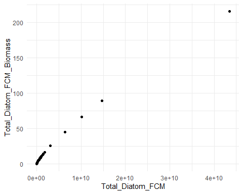
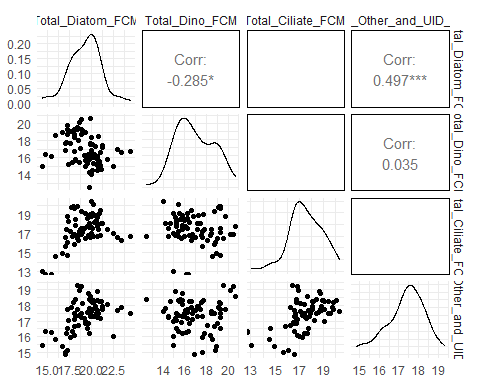
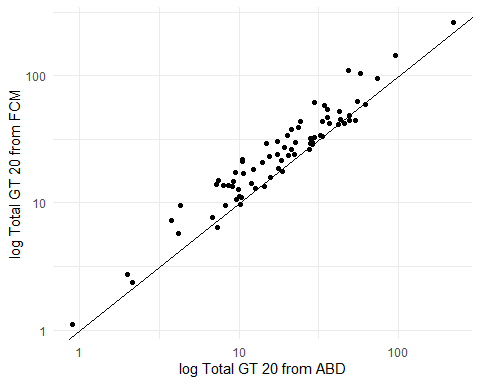
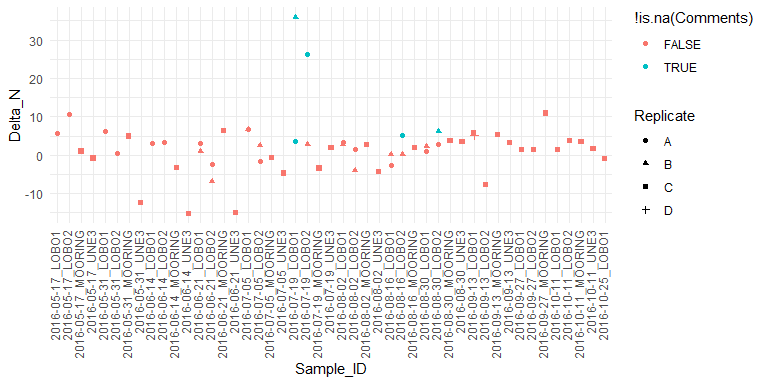
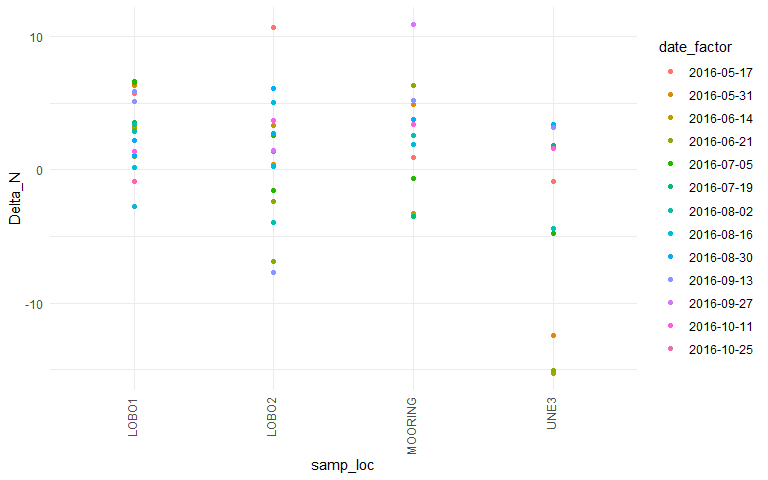
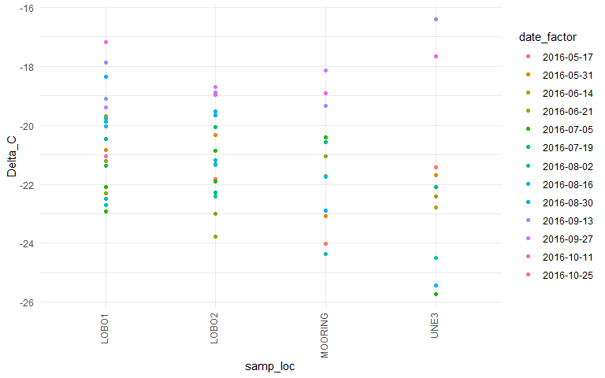
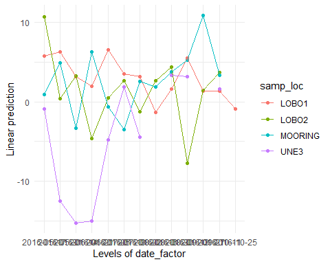
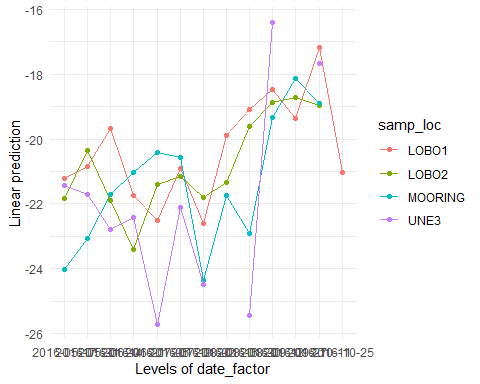

Examining Bigelow Phytoplankton Data File
================

-   [Data Tabs in the Excel File](#data-tabs-in-the-excel-file)
-   [Load Flowcam FCM Data](#load-flowcam-fcm-data)
    -   [Data Groups](#data-groups)
    -   [Flowcam data ABD](#flowcam-data-abd)
    -   [Compare Flowcam Data sets](#compare-flowcam-data-sets)
        -   [Compare Sample IDs](#compare-sample-ids)
        -   [Compare Total Algae Biomass](#compare-total-algae-biomass)
-   [Load Collection Data](#load-collection-data)
-   [Data on Picoplankton and
    Nanoplankton](#data-on-picoplankton-and-nanoplankton)
-   [Data on Chlorophyll and
    Phaeophytin](#data-on-chlorophyll-and-phaeophytin)
-   [Summary data on Chlorophyll and
    Phaephytin](#summary-data-on-chlorophyll-and-phaephytin)
-   [Maximum Photosynthesis Data](#maximum-photosynthesis-data)
-   [Nutrients Data](#nutrients-data)
    -   [Add Organic Nitrogen Data](#add-organic-nitrogen-data)
-   [C N Data and Stable Isotope
    Data](#c-n-data-and-stable-isotope-data)
    -   [Review of Delta\_N data](#review-of-delta_n-data)
-   [Calculate Average Values](#calculate-average-values)
    -   [Graphic Exploration of Site and
        Date](#graphic-exploration-of-site-and-date)
        -   [Delta N Data](#delta-n-data)
        -   [Delta C Data](#delta-c-data)
    -   [Quick Models](#quick-models)
        -   [Delta N Model](#delta-n-model)
        -   [Delta\_C Model](#delta_c-model)
-   [Reflection of data contents.](#reflection-of-data-contents)


\#Introduction In this notebook, I am reviewing data in one of the two
data files I was provided. Principally , this is to get familiar with
the contents of the file, but it is also to check the relationship among
tabs.

\#Load Libraries

``` r
library(tidyverse)
#> -- Attaching packages --------------------------------------- tidyverse 1.3.1 --
#> v ggplot2 3.3.5     v purrr   0.3.4
#> v tibble  3.1.6     v dplyr   1.0.7
#> v tidyr   1.1.4     v stringr 1.4.0
#> v readr   2.1.1     v forcats 0.5.1
#> -- Conflicts ------------------------------------------ tidyverse_conflicts() --
#> x dplyr::filter() masks stats::filter()
#> x dplyr::lag()    masks stats::lag()
library(readxl)

library(GGally)
#> Registered S3 method overwritten by 'GGally':
#>   method from   
#>   +.gg   ggplot2

library(emmeans)
#> 
#> Attaching package: 'emmeans'
#> The following object is masked from 'package:GGally':
#> 
#>     pigs

theme_set(theme_minimal())
```

# Data Tabs in the Excel File

The data in the excel file is divided among many tabs, not all laid out
the same way.

``` r
fn <- 'SEANET_Phyto Data_Bigelow.xlsx'

(tabs <- excel_sheets(fn))
#>  [1] "FCAM FCM"   "COLLECTION" "PICO-NANO"  "CHL"        "Sheet1"    
#>  [6] "FCAM ABD"   "PMAX"       "DIN"        "DON"        "POC1"      
#> [11] "POC2"
```

# Load Flowcam FCM Data

``` r
flowcam_data_FCM <- read_excel(fn, sheet = "FCAM FCM", skip = 59) %>%
  rename_with(.fn = ~sub(" \\(.*", "", .x) ) %>%
 #rename_with(.fn = ~sub("FCM ", "", .x) ) %>%
  rename_with(.fn = ~sub("Vol", "", .x) ) %>%
  rename_with(.fn = ~sub(" *$", "", .x) ) %>%
  rename_with(.fn = ~gsub(" ", "_", .x)) %>%
  rename_with(.fn = ~gsub("\\.", "", .x)) %>%
  rename('Total_GT_20' = starts_with('Total_>'))
```

## Data Groups

Notice that not all groups are equivalent, so these should not be
analyzed as one large group.

``` r
cat ('\n**************Basic Phytoplankton Volumes******************\n')
#> 
#> **************Basic Phytoplankton Volumes******************
names(flowcam_data_FCM)[2:30]
#>  [1] "Mixed_Diatoms_FCM"        "Other_Centric_FCM"       
#>  [3] "Short_Centric_Chains_FCM" "Long_Centric_Chains_FCM" 
#>  [5] "Curly_Centric_Chains_FCM" "Single_Centric_FCM"      
#>  [7] "Chaetoceros_FCM"          "C_socialis_FCM"          
#>  [9] "Rhizosolenia_FCM"         "Mediopyxis_FCM"          
#> [11] "Other_Pennate_FCM"        "Single_Pennate_FCM"      
#> [13] "Chain_Pennate_FCM"        "Thallassionema_FCM"      
#> [15] "Pseudo-nitzschia_FCM"     "Asternionellopsis_FCM"   
#> [17] "Other_Dinos_FCM"          "Dinophysis_FCM"          
#> [19] "Ceratium_FCM"             "C_longipes_FCM"          
#> [21] "C_lineatum_FCM"           "C_fusus_FCM"             
#> [23] "Prorocentrum_FCM"         "Other_Ciliates_FCM"      
#> [25] "Strom-Strob_FCM"          "Mesodinium_FCM"          
#> [27] "Laboea_FCM"               "Dictyocha_FCM"           
#> [29] "Other_and_UID_FCM"
cat ('\n**************Non Phytoplankton ******************\n')
#> 
#> **************Non Phytoplankton ******************
names(flowcam_data_FCM)[31:34]
#> [1] "LT20_FCM"          "Fecal_Pellets_FCM" "Phytodetritus_FCM"
#> [4] "Zooplankton_FCM"
cat ('\n**************Group Total Volumes******************\n')
#> 
#> **************Group Total Volumes******************
names(flowcam_data_FCM)[35:38]
#> [1] "Total_Diatom_FCM"        "Total_Dino_FCM"         
#> [3] "Total_Ciliate_FCM"       "Total_Other_and_UID_FCM"
cat ('\n**************Group Total Biomass******************\n')
#> 
#> **************Group Total Biomass******************
names(flowcam_data_FCM)[39:43]
#> [1] "Total_Diatom_FCM_Biomass"        "Total_Dino_FCM_Biomass"         
#> [3] "Total_Ciliate_FCM_Biomass"       "Total_Other_and_UID_FCM_Biomass"
#> [5] "Total_GT_20"
```

Biomass is a simple function of volumes, so little point in analyzing
both.

``` r
ggplot(flowcam_data_FCM, aes(Total_Diatom_FCM, Total_Diatom_FCM_Biomass)) +
  geom_point()
```



``` r
ggpairs(log(flowcam_data_FCM[35:38]), progress = FALSE)
#> Warning: Removed 1 rows containing missing values (geom_text).

#> Warning: Removed 1 rows containing missing values (geom_text).
#> Warning: Removed 2 rows containing non-finite values (stat_density).
#> Warning: Removed 1 rows containing missing values (geom_text).
```



Why are some not showing correlation coefficients? The problem crops us
for any correlation involving the ciliates, although there are no
missing values or other problems. Note that diatom vs ciliates may show
a non-linear pattern.

A simple Pearson correlation won’t give results, but Spearman and
Kendall do.

``` r
cor(log(flowcam_data_FCM[35:38]), method = 'spearman', use = 'pairwise')
#>                         Total_Diatom_FCM Total_Dino_FCM Total_Ciliate_FCM
#> Total_Diatom_FCM               1.0000000    -0.37315068         0.3096654
#> Total_Dino_FCM                -0.3731507     1.00000000        -0.1350769
#> Total_Ciliate_FCM              0.3096654    -0.13507690         1.0000000
#> Total_Other_and_UID_FCM        0.4955646     0.02874491         0.5469718
#>                         Total_Other_and_UID_FCM
#> Total_Diatom_FCM                     0.49556461
#> Total_Dino_FCM                       0.02874491
#> Total_Ciliate_FCM                    0.54697184
#> Total_Other_and_UID_FCM              1.00000000
```

## Flowcam data ABD

This is apparently based on a slightly different method for estimating
biovolume. These SHOULD be highly correlated with the last set of
values.

``` r
library(readxl)
flowcam_data_ABD <- read_excel("SEANET_Phyto Data_Bigelow.xlsx", 
                               sheet = "FCAM ABD", skip = 58) %>%
  rename_with(.fn = ~sub(" \\(.*", "", .x) ) %>%
  #rename_with(.fn = ~sub("ABD", "", .x) ) %>%
  rename_with(.fn = ~sub("Vol", "", .x) ) %>%
  rename_with(.fn = ~sub(" *$", "", .x) ) %>%
  rename_with(.fn = ~gsub(" ", "_", .x)) %>%
  rename_with(.fn = ~gsub("\\.", "", .x)) %>%
  rename('Total_GT_20' = starts_with('Total_>'))
```

``` r
cbind(names(flowcam_data_FCM), names(flowcam_data_ABD))
#>       [,1]                              [,2]                             
#>  [1,] "Sample_ID"                       "Sample_ID"                      
#>  [2,] "Mixed_Diatoms_FCM"               "Mixed_Diatoms_ABD"              
#>  [3,] "Other_Centric_FCM"               "Other_Centric_ABD"              
#>  [4,] "Short_Centric_Chains_FCM"        "Short_Centric_Chains_ABD"       
#>  [5,] "Long_Centric_Chains_FCM"         "Long_Centric_Chains_ABD"        
#>  [6,] "Curly_Centric_Chains_FCM"        "Curly_Centric_Chains_ABD"       
#>  [7,] "Single_Centric_FCM"              "Single_Centric_ABD"             
#>  [8,] "Chaetoceros_FCM"                 "Chaetoceros_ABD"                
#>  [9,] "C_socialis_FCM"                  "C_socialis_ABD"                 
#> [10,] "Rhizosolenia_FCM"                "Rhizosolenia_ABD"               
#> [11,] "Mediopyxis_FCM"                  "Mediopyxis_ABD"                 
#> [12,] "Other_Pennate_FCM"               "Other_Pennate_ABD"              
#> [13,] "Single_Pennate_FCM"              "Single_Pennate_ABD"             
#> [14,] "Chain_Pennate_FCM"               "Chain_Pennate_ABD"              
#> [15,] "Thallassionema_FCM"              "Thallassionema_ABD"             
#> [16,] "Pseudo-nitzschia_FCM"            "Pseudo-nitzschia_ABD"           
#> [17,] "Asternionellopsis_FCM"           "Asternionellopsis_ABD"          
#> [18,] "Other_Dinos_FCM"                 "Other_Dinos_ABD"                
#> [19,] "Dinophysis_FCM"                  "Dinophysis_ABD"                 
#> [20,] "Ceratium_FCM"                    "Ceratium_ABD"                   
#> [21,] "C_longipes_FCM"                  "C_longipes_ABD"                 
#> [22,] "C_lineatum_FCM"                  "C_lineatum_ABD"                 
#> [23,] "C_fusus_FCM"                     "C_fusus_ABD"                    
#> [24,] "Prorocentrum_FCM"                "Prorocentrum_ABD"               
#> [25,] "Other_Ciliates_FCM"              "Other_Ciliates_ABD"             
#> [26,] "Strom-Strob_FCM"                 "Strom-Strob_ABD"                
#> [27,] "Mesodinium_FCM"                  "Mesodinium_ABD"                 
#> [28,] "Laboea_FCM"                      "Laboea_ABD"                     
#> [29,] "Dictyocha_FCM"                   "Dictyocha_ABD"                  
#> [30,] "Other_and_UID_FCM"               "Other_and_UID_ABD"              
#> [31,] "LT20_FCM"                        "LT20_ABD"                       
#> [32,] "Fecal_Pellets_FCM"               "Fecal_Pellets_ABD"              
#> [33,] "Phytodetritus_FCM"               "Phytodetritus_ABD"              
#> [34,] "Zooplankton_FCM"                 "Zooplankton_ABD"                
#> [35,] "Total_Diatom_FCM"                "Total_Diatom_ABD"               
#> [36,] "Total_Dino_FCM"                  "Total_Dino_ABD"                 
#> [37,] "Total_Ciliate_FCM"               "Total_Ciliate_ABD"              
#> [38,] "Total_Other_and_UID_FCM"         "Total_Other_and_UID_ABD"        
#> [39,] "Total_Diatom_FCM_Biomass"        "Total_Diatom_ABD_Biomass"       
#> [40,] "Total_Dino_FCM_Biomass"          "Total_Dino_ABD_Biomass"         
#> [41,] "Total_Ciliate_FCM_Biomass"       "Total_Ciliate_ABD_Biomass"      
#> [42,] "Total_Other_and_UID_FCM_Biomass" "Total_Other_and_UID_ABD_Biomass"
#> [43,] "Total_GT_20"                     "Total_GT_20"                    
#> [44,] "Comments"                        "Comments"
```

## Compare Flowcam Data sets

### Compare Sample IDs

We note two samples in the ABD tab that lack sample IDs, although all
other sample IDs match.

``` r
test <- cbind(flowcam_data_FCM$Sample_ID, flowcam_data_ABD$Sample_ID)
which(test[,1] != test[,2])
#> integer(0)
which(test[,1] != test[,2])
#> integer(0)
which(is.na(test[,1]))
#> integer(0)
which(is.na(test[,2]))
#> [1] 25 26
```

I suspect data corruption somewhere, so for now, I’ll substitute the
Sample ID from the other tab.

``` r
flowcam_data_ABD$Sample_ID[25] <- flowcam_data_FCM$Sample_ID[25]
flowcam_data_ABD$Sample_ID[26] <- flowcam_data_FCM$Sample_ID[26]
```

### Compare Total Algae Biomass

``` r
flowcam_data_ABD %>%
  select(Sample_ID, Total_GT_20 ) %>%
  rename(tot = Total_GT_20) %>%
  full_join(flowcam_data_FCM) %>%
  select(Sample_ID, Total_GT_20, tot) %>%
  ggplot(aes(Total_GT_20, tot)) +
  geom_point() +
  geom_abline(intercept = 0, slope = 1) +
  scale_y_log10() +
  scale_x_log10() +
  xlab('log Total GT 20 from ABD') +
  ylab('log Total GT 20 from FCM')
#> Joining, by = "Sample_ID"
```



So, the two metrics provide similar estimates of total biomass GT 20,
with FCM usually estimating slightly larger totals. I suspect we can
treat these two tabs as nearly equivalent. I will leave it up to Kevin
to decide which to use. For now, I will work with the FCM tab only.

# Load Collection Data

``` r
collection_data <- read_excel("SEANET_Phyto Data_Bigelow.xlsx", 
    sheet = "COLLECTION", col_types = c("date", 
        "date", "text", "numeric", "text", 
        "text", "text", "text", "date", "text", 
        "numeric", "numeric", "text", "text", 
        "text", "text", "text", "text", "numeric", 
        "numeric", "numeric", "numeric"), 
    skip = 20, na = '-999') %>%
  rename_with(.fn = ~sub(" \\(.*", "", .x) ) %>%
  rename_with(.fn = ~gsub(" ", "_", .x))
```

That does not properly import the time of sample collection, but that’s
not worth fixing at this level of review.

The last four columns here are apparently copied from the PICO-NANO tab.
However, it looks like the copied data did not correctly account for the
inconsistent labeling on that tab.

# Data on Picoplankton and Nanoplankton

``` r
pico_data <- read_excel("SEANET_Phyto Data_Bigelow.xlsx", 
                        sheet = "PICO-NANO")  %>%
  rename_with(.fn = ~sub(" \\(.*", "", .x) ) %>%
  rename_with(.fn = ~gsub(" ", "_", .x))
```

We note that we have one MORE sample here than indicated in the data on
sample collection. This is because one sample ID is not represented and
two sample IDs are duplicated.

``` r
 collection_data$Sample_ID[ ! collection_data$Sample_ID %in% pico_data$Sample_ID ]
#> [1] "SNT_2016-08-03_BUOY"
```

``` r
pico_data$Sample_ID[duplicated( pico_data$Sample_ID)]
#> [1] "SNT_2016-08-02_UNE3"  "SNT_2016-08-30_LOBO1"
```

It’s possible the first is a mis-labeling, since the duplicate is
adjacent to the missing value. THe second, however, can not be explained
away so readily.

Let’s check sample alignment

``` r
collection_data %>%
  select(Sample_ID, Total_Phyto_Conc) %>%
  rename(Total = Total_Phyto_Conc) %>%
  full_join(pico_data, by = "Sample_ID") %>%
  select(Sample_ID, Total, Total_Phyto_Conc)
#> # A tibble: 79 x 3
#>    Sample_ID             Total Total_Phyto_Conc
#>    <chr>                 <dbl>            <dbl>
#>  1 SNT_2016-04-19_LOBO1 26461.           26461.
#>  2 SNT_2016-04-19_LOBO2 17741.           17741.
#>  3 SNT_2016-04-19_UNE3  19880.           19880.
#>  4 SNT_2016-04-20_BUOY  20470.           20470.
#>  5 SNT_2016-04-20_RAM   17249.           17249.
#>  6 SNT_2016-04-20_WOOD  18838.           18838.
#>  7 SNT_2016-05-03_LOBO1 22383.           22383.
#>  8 SNT_2016-05-03_LOBO2 13474.           13474.
#>  9 SNT_2016-05-03_UNE3  12049.           12049.
#> 10 SNT_2016-05-04_BUOY  20920.           20920.
#> # ... with 69 more rows
```

# Data on Chlorophyll and Phaeophytin

We drop the “pre calculated” means and standard deviations for the time
being.

``` r
chl_data <-   read_excel("SEANET_Phyto Data_Bigelow.xlsx", 
                        sheet = "CHL", skip = 25) %>%
  select(-starts_with('Avg')) %>%
  rename_with(.fn = ~sub(" \\(.*", "", .x) ) %>%
  rename_with(.fn = ~gsub(" ", "_", .x)) %>%
  mutate(Replicate = substr(Sample_ID, nchar(Sample_ID), nchar(Sample_ID)),
         Sample_ID = substr(Sample_ID, 1, nchar(Sample_ID)-2)) %>%
  relocate(Replicate, .after = 'Sample_ID')
```

# Summary data on Chlorophyll and Phaephytin

The rows of data with just the averages appear to have been copied to
the next Tab in the spreadsheet. This is likely to be convenient for
comparison with other environmental variables.

``` r
chl_avg_data <- read_excel("SEANET_Phyto Data_Bigelow.xlsx", 
    sheet = "Sheet1", col_types = c("text", 
        "date", "numeric", "numeric", "numeric", 
        "numeric", "numeric", "numeric"))
#> Warning in read_fun(path = enc2native(normalizePath(path)), sheet_i = sheet, :
#> Coercing numeric to date B2 / R2C2
#> Warning in read_fun(path = enc2native(normalizePath(path)), sheet_i = sheet, :
#> Coercing numeric to date B3 / R3C2
#> Warning in read_fun(path = enc2native(normalizePath(path)), sheet_i = sheet, :
#> Coercing numeric to date B4 / R4C2
#> Warning in read_fun(path = enc2native(normalizePath(path)), sheet_i = sheet, :
#> Coercing numeric to date B5 / R5C2
#> Warning in read_fun(path = enc2native(normalizePath(path)), sheet_i = sheet, :
#> Coercing numeric to date B6 / R6C2
#> Warning in read_fun(path = enc2native(normalizePath(path)), sheet_i = sheet, :
#> Coercing numeric to date B7 / R7C2
#> Warning in read_fun(path = enc2native(normalizePath(path)), sheet_i = sheet, :
#> Coercing numeric to date B8 / R8C2
#> Warning in read_fun(path = enc2native(normalizePath(path)), sheet_i = sheet, :
#> Coercing numeric to date B9 / R9C2
#> Warning in read_fun(path = enc2native(normalizePath(path)), sheet_i = sheet, :
#> Coercing numeric to date B10 / R10C2
#> Warning in read_fun(path = enc2native(normalizePath(path)), sheet_i = sheet, :
#> Coercing numeric to date B11 / R11C2
#> Warning in read_fun(path = enc2native(normalizePath(path)), sheet_i = sheet, :
#> Coercing numeric to date B12 / R12C2
#> Warning in read_fun(path = enc2native(normalizePath(path)), sheet_i = sheet, :
#> Coercing numeric to date B13 / R13C2
#> Warning in read_fun(path = enc2native(normalizePath(path)), sheet_i = sheet, :
#> Coercing numeric to date B14 / R14C2
#> Warning in read_fun(path = enc2native(normalizePath(path)), sheet_i = sheet, :
#> Coercing numeric to date B15 / R15C2
#> Warning in read_fun(path = enc2native(normalizePath(path)), sheet_i = sheet, :
#> Coercing numeric to date B16 / R16C2
#> Warning in read_fun(path = enc2native(normalizePath(path)), sheet_i = sheet, :
#> Coercing numeric to date B17 / R17C2
#> Warning in read_fun(path = enc2native(normalizePath(path)), sheet_i = sheet, :
#> Coercing numeric to date B18 / R18C2
#> Warning in read_fun(path = enc2native(normalizePath(path)), sheet_i = sheet, :
#> Coercing numeric to date B19 / R19C2
#> Warning in read_fun(path = enc2native(normalizePath(path)), sheet_i = sheet, :
#> Coercing numeric to date B20 / R20C2
#> Warning in read_fun(path = enc2native(normalizePath(path)), sheet_i = sheet, :
#> Coercing numeric to date B21 / R21C2
#> Warning in read_fun(path = enc2native(normalizePath(path)), sheet_i = sheet, :
#> Coercing numeric to date B22 / R22C2
#> Warning in read_fun(path = enc2native(normalizePath(path)), sheet_i = sheet, :
#> Coercing numeric to date B23 / R23C2
#> Warning in read_fun(path = enc2native(normalizePath(path)), sheet_i = sheet, :
#> Coercing numeric to date B24 / R24C2
#> Warning in read_fun(path = enc2native(normalizePath(path)), sheet_i = sheet, :
#> Coercing numeric to date B25 / R25C2
#> Warning in read_fun(path = enc2native(normalizePath(path)), sheet_i = sheet, :
#> Coercing numeric to date B26 / R26C2
#> Warning in read_fun(path = enc2native(normalizePath(path)), sheet_i = sheet, :
#> Coercing numeric to date B27 / R27C2
#> Warning in read_fun(path = enc2native(normalizePath(path)), sheet_i = sheet, :
#> Coercing numeric to date B28 / R28C2
#> Warning in read_fun(path = enc2native(normalizePath(path)), sheet_i = sheet, :
#> Coercing numeric to date B29 / R29C2
#> Warning in read_fun(path = enc2native(normalizePath(path)), sheet_i = sheet, :
#> Coercing numeric to date B30 / R30C2
#> Warning in read_fun(path = enc2native(normalizePath(path)), sheet_i = sheet, :
#> Coercing numeric to date B31 / R31C2
#> Warning in read_fun(path = enc2native(normalizePath(path)), sheet_i = sheet, :
#> Coercing numeric to date B32 / R32C2
#> Warning in read_fun(path = enc2native(normalizePath(path)), sheet_i = sheet, :
#> Coercing numeric to date B33 / R33C2
#> Warning in read_fun(path = enc2native(normalizePath(path)), sheet_i = sheet, :
#> Coercing numeric to date B34 / R34C2
#> Warning in read_fun(path = enc2native(normalizePath(path)), sheet_i = sheet, :
#> Coercing numeric to date B35 / R35C2
#> Warning in read_fun(path = enc2native(normalizePath(path)), sheet_i = sheet, :
#> Coercing numeric to date B36 / R36C2
#> Warning in read_fun(path = enc2native(normalizePath(path)), sheet_i = sheet, :
#> Coercing numeric to date B37 / R37C2
#> Warning in read_fun(path = enc2native(normalizePath(path)), sheet_i = sheet, :
#> Coercing numeric to date B38 / R38C2
#> Warning in read_fun(path = enc2native(normalizePath(path)), sheet_i = sheet, :
#> Coercing numeric to date B39 / R39C2
#> Warning in read_fun(path = enc2native(normalizePath(path)), sheet_i = sheet, :
#> Coercing numeric to date B40 / R40C2
#> Warning in read_fun(path = enc2native(normalizePath(path)), sheet_i = sheet, :
#> Coercing numeric to date B41 / R41C2
#> Warning in read_fun(path = enc2native(normalizePath(path)), sheet_i = sheet, :
#> Coercing numeric to date B42 / R42C2
#> Warning in read_fun(path = enc2native(normalizePath(path)), sheet_i = sheet, :
#> Coercing numeric to date B43 / R43C2
#> Warning in read_fun(path = enc2native(normalizePath(path)), sheet_i = sheet, :
#> Coercing numeric to date B44 / R44C2
#> Warning in read_fun(path = enc2native(normalizePath(path)), sheet_i = sheet, :
#> Coercing numeric to date B45 / R45C2
#> Warning in read_fun(path = enc2native(normalizePath(path)), sheet_i = sheet, :
#> Coercing numeric to date B46 / R46C2
#> Warning in read_fun(path = enc2native(normalizePath(path)), sheet_i = sheet, :
#> Coercing numeric to date B47 / R47C2
#> Warning in read_fun(path = enc2native(normalizePath(path)), sheet_i = sheet, :
#> Coercing numeric to date B48 / R48C2
#> Warning in read_fun(path = enc2native(normalizePath(path)), sheet_i = sheet, :
#> Coercing numeric to date B49 / R49C2
#> Warning in read_fun(path = enc2native(normalizePath(path)), sheet_i = sheet, :
#> Coercing numeric to date B50 / R50C2
#> Warning in read_fun(path = enc2native(normalizePath(path)), sheet_i = sheet, :
#> Coercing numeric to date B51 / R51C2
#> Warning in read_fun(path = enc2native(normalizePath(path)), sheet_i = sheet, :
#> Coercing numeric to date B52 / R52C2
#> Warning in read_fun(path = enc2native(normalizePath(path)), sheet_i = sheet, :
#> Coercing numeric to date B53 / R53C2
#> Warning in read_fun(path = enc2native(normalizePath(path)), sheet_i = sheet, :
#> Coercing numeric to date B54 / R54C2
#> Warning in read_fun(path = enc2native(normalizePath(path)), sheet_i = sheet, :
#> Coercing numeric to date B55 / R55C2
#> Warning in read_fun(path = enc2native(normalizePath(path)), sheet_i = sheet, :
#> Coercing numeric to date B56 / R56C2
#> Warning in read_fun(path = enc2native(normalizePath(path)), sheet_i = sheet, :
#> Coercing numeric to date B57 / R57C2
#> Warning in read_fun(path = enc2native(normalizePath(path)), sheet_i = sheet, :
#> Coercing numeric to date B58 / R58C2
#> Warning in read_fun(path = enc2native(normalizePath(path)), sheet_i = sheet, :
#> Coercing numeric to date B59 / R59C2
#> Warning in read_fun(path = enc2native(normalizePath(path)), sheet_i = sheet, :
#> Coercing numeric to date B60 / R60C2
#> Warning in read_fun(path = enc2native(normalizePath(path)), sheet_i = sheet, :
#> Coercing numeric to date B61 / R61C2
#> Warning in read_fun(path = enc2native(normalizePath(path)), sheet_i = sheet, :
#> Coercing numeric to date B62 / R62C2
#> Warning in read_fun(path = enc2native(normalizePath(path)), sheet_i = sheet, :
#> Coercing numeric to date B63 / R63C2
#> Warning in read_fun(path = enc2native(normalizePath(path)), sheet_i = sheet, :
#> Coercing numeric to date B64 / R64C2
#> Warning in read_fun(path = enc2native(normalizePath(path)), sheet_i = sheet, :
#> Coercing numeric to date B65 / R65C2
#> Warning in read_fun(path = enc2native(normalizePath(path)), sheet_i = sheet, :
#> Coercing numeric to date B66 / R66C2
#> Warning in read_fun(path = enc2native(normalizePath(path)), sheet_i = sheet, :
#> Coercing numeric to date B67 / R67C2
#> Warning in read_fun(path = enc2native(normalizePath(path)), sheet_i = sheet, :
#> Coercing numeric to date B68 / R68C2
#> Warning in read_fun(path = enc2native(normalizePath(path)), sheet_i = sheet, :
#> Coercing numeric to date B69 / R69C2
#> Warning in read_fun(path = enc2native(normalizePath(path)), sheet_i = sheet, :
#> Coercing numeric to date B70 / R70C2
#> Warning in read_fun(path = enc2native(normalizePath(path)), sheet_i = sheet, :
#> Coercing numeric to date B71 / R71C2
#> Warning in read_fun(path = enc2native(normalizePath(path)), sheet_i = sheet, :
#> Coercing numeric to date B72 / R72C2
#> Warning in read_fun(path = enc2native(normalizePath(path)), sheet_i = sheet, :
#> Coercing numeric to date B73 / R73C2
#> Warning in read_fun(path = enc2native(normalizePath(path)), sheet_i = sheet, :
#> Coercing numeric to date B74 / R74C2
#> Warning in read_fun(path = enc2native(normalizePath(path)), sheet_i = sheet, :
#> Coercing numeric to date B75 / R75C2
#> Warning in read_fun(path = enc2native(normalizePath(path)), sheet_i = sheet, :
#> Coercing numeric to date B76 / R76C2
#> Warning in read_fun(path = enc2native(normalizePath(path)), sheet_i = sheet, :
#> Coercing numeric to date B77 / R77C2
#> Warning in read_fun(path = enc2native(normalizePath(path)), sheet_i = sheet, :
#> Coercing numeric to date B78 / R78C2
```

# Maximum Photosynthesis Data

``` r
pmax_data <- read_excel("SEANET_Phyto Data_Bigelow.xlsx", 
    sheet = "PMAX", skip = 12)

names(pmax_data) <- c('Sample_ID', 'pmax', 'pmax_chl', 'Comments')
```

# Nutrients Data

``` r
nutrients_data <-  read_excel("SEANET_Phyto Data_Bigelow.xlsx",
                              sheet = "DIN", skip = 5)
names(nutrients_data) <- c('Sample_ID', 'NOx', 'NO2', 'NO3',
                           'NH4', 'PO4', 'Si')
```

## Add Organic Nitrogen Data

``` r
DON_data <- read_excel("SEANET_Phyto Data_Bigelow.xlsx", 
    sheet = "DON", skip = 5)
names(DON_data) <- c("Sample_ID", "DON")

nutrients_data <- nutrients_data %>%
  full_join(DON_data, by = "Sample_ID") %>%
  relocate(DON, .after = NH4)
```

``` r
rm(DON_data)
```

# C N Data and Stable Isotope Data

this is found in two different Tabs. It appears these are some replicate
analyses here, labeled in confusing ways….

One the Elemental N and C values, they are labeled as “not blank
corrected”. I am not sure whether they should be blank corrected, and if
so, how to do so correctly. MY tendency would be to “correct” by the man
value of the blanks. This would have a small effect on elemental carbon,
but a sizable effect on elemental nitrogen.

Because of these uncertainties, I focus only on the stable isotope
figures.

``` r
POC1_data <- read_excel("SEANET_Phyto Data_Bigelow.xlsx", 
                        sheet = "POC1", skip = 11, n_max = 30) %>%
  rename(Sample_ID = `Sample ID`) %>%
  mutate(Replicate = substr(Sample_ID, nchar(Sample_ID), nchar(Sample_ID)),
         Sample_ID = substr(Sample_ID, 1, nchar(Sample_ID)-2)) %>%
  relocate(Replicate, .after = 'Sample_ID') %>%
  select(c(1,2,9,10, 11))
  
names(POC1_data)[3] <- 'Delta_N'
names(POC1_data)[4] <- 'Delta_C'
```

``` r
POC2_data <- read_excel("SEANET_Phyto Data_Bigelow.xlsx", 
                        sheet = "POC2", skip = 11, n_max = 30) %>%
  rename(Sample_ID = `Sample ID`) %>%
  mutate(Replicate = 'C') %>%
  relocate(Replicate, .after = 'Sample_ID') %>%
  select(c(1,2,10, 11, 12))

POC2_data$Replicate[19] <- 'D'  # Only apparent duplicate in second round of analysis

names(POC2_data)[3] <- 'Delta_N'
names(POC2_data)[4] <- 'Delta_C'
```

``` r
POC_data <- POC1_data %>%
  bind_rows(POC2_data)
rm(POC1_data, POC2_data)
```

## Review of Delta\_N data

``` r
ggplot(POC_data, aes(Sample_ID, Delta_N)) +
  geom_point(aes(color = ! is.na(Comments), shape = Replicate)) +
  theme(axis.text.x = element_text(angle = 90, hjust = 1, vjust = 0.2))
```



So, looking at that, we see the two outliers, which were flagged in the
analytic results. We delete them.

``` r
POC_data <- POC_data %>%
  mutate(Delta_N = if_else(row_number() %in% c(16,17), NA_real_, Delta_N))
```

# Calculate Average Values

``` r
POC_data_sum <- POC_data %>%
  group_by(Sample_ID) %>%
  summarize(Delta_N_mean = mean(Delta_N, na.rm = TRUE),
            Delta_N_SD =   sd(Delta_N, na.rm = TRUE),
            Deta_N_n  =    sum(! is.na(Delta_N)),
            Delta_C_mean = mean(Delta_C, na.rm = TRUE),
            Delta_C_SD =   sd(Delta_C, na.rm = TRUE),
            Deta_C_n  =    sum(! is.na(Delta_C)))
```

WE have only a single measurement at most samples, yet the standard
errors are fairly large for those samples where we **do** have
replicates. Careful analysis would estimate standard errors based on a
hierarchical model for those samples with only a single analysis.

## Graphic Exploration of Site and Date

### Delta N Data

``` r
POC_data_test <- POC_data %>%
  select(-Comments) %>%
  mutate(samp_date = as.Date(substr(Sample_ID, 1,10), format = '%Y-%m-%d'),
         samp_loc  = substr(Sample_ID, 12, nchar(Sample_ID)),
         samp_loc = factor(samp_loc),
         date_factor = factor(samp_date))
```

``` r
ggplot(POC_data_test, aes(samp_loc, Delta_N)) +
  geom_point(aes(color = date_factor)) +
  theme(axis.text.x = element_text(angle = 90, hjust = 1, vjust = 0.2))
#> Warning: Removed 2 rows containing missing values (geom_point).
```



### Delta C Data

``` r
ggplot(POC_data_test, aes(samp_loc, Delta_C)) +
  geom_point(aes(color = date_factor)) +
  theme(axis.text.x = element_text(angle = 90, hjust = 1, vjust = 0.2))
```



So, looking at Carbon, it looks like midsummer samples tend to be low
Delta C Except at the Mooring location.

## Quick Models

### Delta N Model

``` r
delta_N_lm <- lm(Delta_N ~ samp_loc * date_factor,  data = POC_data_test)
anova(delta_N_lm)
#> Analysis of Variance Table
#> 
#> Response: Delta_N
#>                      Df Sum Sq Mean Sq F value   Pr(>F)    
#> samp_loc              3 384.03 128.010 24.7683 3.41e-05 ***
#> date_factor          12 268.89  22.407  4.3356 0.010560 *  
#> samp_loc:date_factor 31 819.74  26.443  5.1165 0.003281 ** 
#> Residuals            11  56.85   5.168                     
#> ---
#> Signif. codes:  0 '***' 0.001 '**' 0.01 '*' 0.05 '.' 0.1 ' ' 1
```

``` r
emmip(delta_N_lm, samp_loc ~ date_factor)
#> Warning: Removed 5 rows containing missing values (geom_point).
#> Warning: Removed 3 row(s) containing missing values (geom_path).
```



So, what jumps out is the UNE site, in the spring, is doing something
very different. THe UNE site is on the Saco, so likely dominated by
freshwater runoff in the spring. I tend to believe just about everything
else is just noise, but it is hard to tell from this plot alone.

### Delta\_C Model

``` r
delta_C_lm <- lm(Delta_C ~ samp_loc * date_factor,  data = POC_data_test)
anova(delta_C_lm)
#> Analysis of Variance Table
#> 
#> Response: Delta_C
#>                      Df  Sum Sq Mean Sq F value    Pr(>F)    
#> samp_loc              3  16.697  5.5657  9.7369  0.001232 ** 
#> date_factor          12 134.129 11.1775 19.5544 2.315e-06 ***
#> samp_loc:date_factor 31  72.544  2.3401  4.0940  0.004803 ** 
#> Residuals            13   7.431  0.5716                      
#> ---
#> Signif. codes:  0 '***' 0.001 '**' 0.01 '*' 0.05 '.' 0.1 ' ' 1
```

``` r
emmip(delta_C_lm, samp_loc ~ date_factor)
#> Warning: Removed 5 rows containing missing values (geom_point).
#> Warning: Removed 3 row(s) containing missing values (geom_path).
```



So here we see a stronger seasonal pattern at all sites, again with UNE
doing something slightly different, and possibly the Mooring also doing
something.

# Reflection of data contents.

1.  We have collection records for 77 samples.

2.  We also have 77 rows for

    -   `chl_avg_data`  
    -   `nutrients_data`  
    -   `pmax_data`

3.  `pico_data` has 78 rows, because of exactly one replicate sample

4.  We have only 74 rows in the flowcam community data

5.  The two different community analysis methods appear correlated.

6.  The POC data is more selective, with only 47 unique sample IDs.
