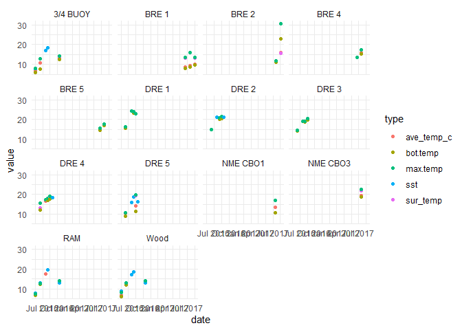
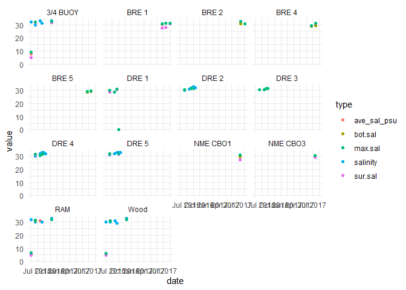
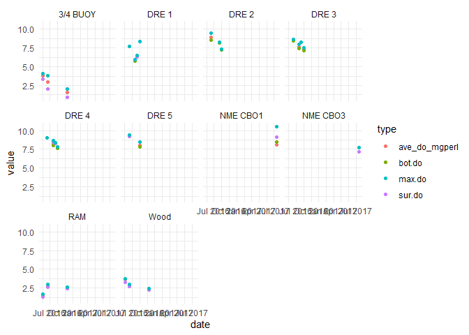
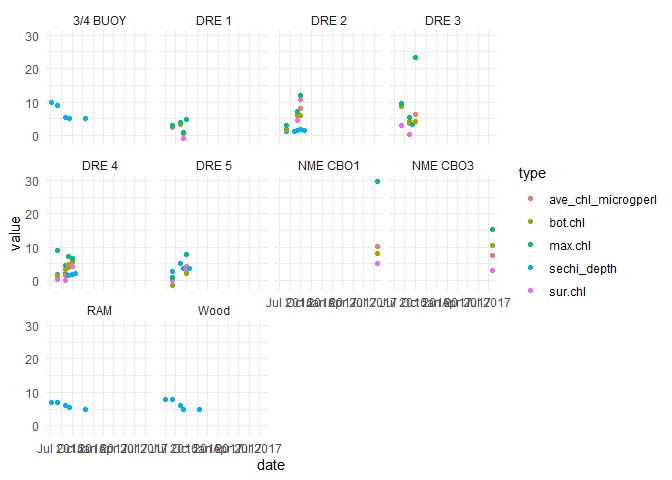

Examining Zooplankton Data File
================

-   [Data Tabs in the Excel File](#data-tabs-in-the-excel-file)
-   [Environmental Data](#environmental-data)
    -   [Site Locations](#site-locations)
    -   [Environmental Variables](#environmental-variables)
        -   [Temperature variables](#temperature-variables)
        -   [Salinity variables](#salinity-variables)
        -   [DO Data](#do-data)
        -   [Chlorophyll Numbers](#chlorophyll-numbers)
-   [Check Site and Date alignment with Phytoplankton
    samples](#check-site-and-date-alignment-with-phytoplankton-samples)
    -   [Load phyto Collection Data](#load-phyto-collection-data)
        -   [Deal with censored Secchi Depth
            data](#deal-with-censored-secchi-depth-data)
    -   [Find Core Sample ID values](#find-core-sample-id-values)
        -   [Extract Core Enviro Data](#extract-core-enviro-data)
-   [Look at Zooplankton Data](#look-at-zooplankton-data)
    -   [Long Data](#long-data)
        -   [Community Data Matrix](#community-data-matrix)
-   [We have to deal with two rows of Balanus from one
    sample](#we-have-to-deal-with-two-rows-of-balanus-from-one-sample)
    -   [Reorder columns by mean count](#reorder-columns-by-mean-count)


\#Introduction In this notebook, I am reviewing data in one of the two
data files I was provided. Principally , this is to get familiar with
the contents of the file, but it is also to check the relationship among
tabs.

\#Load Libraries

``` r
library(tidyverse)
#> -- Attaching packages --------------------------------------- tidyverse 1.3.1 --
#> v ggplot2 3.3.5     v purrr   0.3.4
#> v tibble  3.1.6     v dplyr   1.0.7
#> v tidyr   1.1.4     v stringr 1.4.0
#> v readr   2.1.1     v forcats 0.5.1
#> -- Conflicts ------------------------------------------ tidyverse_conflicts() --
#> x dplyr::filter() masks stats::filter()
#> x dplyr::lag()    masks stats::lag()
library(readxl)

library(GGally)
#> Registered S3 method overwritten by 'GGally':
#>   method from   
#>   +.gg   ggplot2

theme_set(theme_minimal())
```

# Data Tabs in the Excel File

The data in the excel file is divided among many tabs, not all laid out
the same way.

``` r
fn <- 'Seanet ALL DATA FIlE.xlsx'
(tabs <- excel_sheets(fn))
#> [1] "Phyto_Enviromental" "Zooplankton"        "Zoop_Diversity "   
#> [4] "Zoop_Composition"   "Phyto Calc"
```

# Environmental Data

``` r
enviro_data <- read_excel("Seanet ALL DATA FILE.xlsx", 
    sheet = "Phyto_Enviromental", range = "a1:an53") %>%
  rename_with(.fn = ~sub(" *$", "", .x) ) %>%
  rename_with(.fn = ~gsub(" ", "_", .x)) %>%
  select(-c(riv_km:tide_height)) %>%
  mutate(mock_id = paste0('SNT_',date, '_', bigelow_id )) %>%
  relocate(mock_id)
```

## Site Locations

Note that RAM and WOOD are recorded with multiple different latitude and
longitude values.

The last pair of RAM and Wood site records give different latitudes and
longitudes.

``` r
cbind(enviro_data$latitude_decdeg[enviro_data$ID == 'RAM'],
      enviro_data$longitude_decdeg[enviro_data$ID == 'RAM'])
#>        [,1]   [,2]
#> [1,] 43.466 70.359
#> [2,] 43.466 70.359
#> [3,] 43.466 70.359
#> [4,] 43.466 70.359
#> [5,] 43.457 70.345
```

That last value matches the usual location for the “Wood” sampling site.

``` r
cbind(enviro_data$latitude_decdeg[enviro_data$ID == 'Wood'],
      enviro_data$longitude_decdeg[enviro_data$ID == 'Wood'])
#>        [,1]   [,2]
#> [1,] 43.457 70.345
#> [2,] 43.457 70.345
#> [3,] 43.457 70.345
#> [4,] 43.457 70.345
#> [5,] 43.477 70.315
```

The last “Wood” Lat Long data actually matches the “3/4 Buoy” location.

That suggests an alignment problem in Excel.Specifically, I expect it’s
a copy error for those two samples ONLY. Since none of the other lats
and longs fail to match, it’s probably just those two, but it calls into
question the alignment on the rest of the data sheet.

## Environmental Variables

It’s not at all clear what the source of all these environmental
variables are. It looks like some are raw observations (`sst`,
`salinity`, `sechi_depth`), while most are derived statistics,
presumably from sonde downcasts.

### Temperature variables

``` r
t_data <- enviro_data %>%
  select(ID, date, sst, contains('temp')) %>%
  mutate(across(ave_temp_c:max.temp, as.numeric)) %>%
  pivot_longer(sst:temp.gradient, names_to = 'type', values_to = 'value') %>%
  filter(! is.na(value))
#> Warning in mask$eval_all_mutate(quo): NAs introduced by coercion

#> Warning in mask$eval_all_mutate(quo): NAs introduced by coercion

#> Warning in mask$eval_all_mutate(quo): NAs introduced by coercion

#> Warning in mask$eval_all_mutate(quo): NAs introduced by coercion
```

``` r
t_data %>%
  filter(type != 'temp.gradient') %>%

ggplot(aes(x = date, y = value, color = type)) +
  geom_point() +
  facet_wrap(~ID)
```



So, Temperature data is unequally available, with some sites principally
available in 2016, others principally in 2017.

``` r
xtabs(~ date + ID, data = t_data)
#>             ID
#> date         3/4 BUOY BRE 1 BRE 2 BRE 4 BRE 5 DRE 1 DRE 2 DRE 3 DRE 4 DRE 5
#>   2016-05-18        6     0     0     0     0     0     0     0     0     0
#>   2016-06-14        0     0     0     0     0     5     6     5     6     6
#>   2016-06-15        6     0     0     0     0     0     0     0     0     0
#>   2016-07-19        0     0     0     0     0     5     1     5     4     1
#>   2016-07-20        1     0     0     0     0     0     0     0     0     0
#>   2016-08-02        0     0     0     0     0     5     6     5     6     1
#>   2016-08-03        1     0     0     0     0     0     0     0     0     0
#>   2016-08-16        0     0     0     0     0     5     6     5     6     6
#>   2016-08-30        0     0     0     0     0     0     1     0     1     1
#>   2016-10-12        6     0     0     0     0     0     0     0     0     0
#>   2017-06-21        0     5     0     5     5     0     0     0     0     0
#>   2017-07-17        0     0     0     0     0     0     0     0     0     0
#>   2017-07-19        0     5     5     5     5     0     0     0     0     0
#>   2017-08-17        0     5     5     0     0     0     0     0     0     0
#>             ID
#> date         NME CBO1 NME CBO3 RAM Wood
#>   2016-05-18        0        0   6    6
#>   2016-06-14        0        0   0    0
#>   2016-06-15        0        0   6    6
#>   2016-07-19        0        0   0    0
#>   2016-07-20        0        0   2    1
#>   2016-08-02        0        0   0    0
#>   2016-08-03        0        0   1    1
#>   2016-08-16        0        0   0    0
#>   2016-08-30        0        0   0    0
#>   2016-10-12        0        0   6    6
#>   2017-06-21        0        0   0    0
#>   2017-07-17        5        5   0    0
#>   2017-07-19        0        0   0    0
#>   2017-08-17        0        0   0    0
```

So, we have insanely uneven sampling histories.

### Salinity variables

``` r
s_data <- enviro_data %>%
  select(ID, date, salinity, contains('sal'))%>%
  mutate(across(ave_sal_psu:max.sal, as.numeric)) %>%
  pivot_longer(salinity:sal.gradient, names_to = 'type', values_to = 'value') %>%
  filter(! is.na(value))
#> Warning in mask$eval_all_mutate(quo): NAs introduced by coercion

#> Warning in mask$eval_all_mutate(quo): NAs introduced by coercion

#> Warning in mask$eval_all_mutate(quo): NAs introduced by coercion

#> Warning in mask$eval_all_mutate(quo): NAs introduced by coercion
```

``` r
s_data %>%
  filter(type != 'sal.gradient') %>%

ggplot(aes(x = date, y = value, color = type)) +
  geom_point() +
  facet_wrap(~ID)
```



We see huge salinity gradients once each at 3/4 buoy, RAM, Wood and DRE
1.

### DO Data

``` r
do_data <- enviro_data %>%
  select(ID, date, contains('do')) %>%
  mutate(across(ave_do_sat:max.do, as.numeric))
#> Warning in mask$eval_all_mutate(quo): NAs introduced by coercion

#> Warning in mask$eval_all_mutate(quo): NAs introduced by coercion

#> Warning in mask$eval_all_mutate(quo): NAs introduced by coercion

#> Warning in mask$eval_all_mutate(quo): NAs introduced by coercion

#> Warning in mask$eval_all_mutate(quo): NAs introduced by coercion

#> Warning in mask$eval_all_mutate(quo): NAs introduced by coercion

#> Warning in mask$eval_all_mutate(quo): NAs introduced by coercion

#> Warning in mask$eval_all_mutate(quo): NAs introduced by coercion
```

We note one samples where DO value and DO Saturation value have likely
been reversed and one sample where the DO value has been recorded
incorrectly, perhaps due to a transcription error.

``` r
err1 <- do_data %>%
  filter(ID == 'DRE 5', ave_do_sat < 50)

(err1_do <- err1 %>% pull(ave_do_sat))
#> [1] 9.342031
(err1_sat <- err1 %>% pull(ave_do_mgperl))
#> [1] 102.2672

do_data$ave_do_mgperl[do_data$ID == 'DRE 5' & 
                        do_data$ave_do_sat < 50] <- err1_do
do_data$ave_do_sat[do_data$ID == 'DRE 5' & 
                     do_data$ave_do_sat < 50] <- err1_sat

rm(err1)
```

Here we suspect the DO value was mis-transcribed. This whole sample
needs checking.

``` r
do_data %>%
  filter(ID == 'NME CBO3')
#> # A tibble: 1 x 10
#>   ID       date                ave_do_sat ave_do_mgperl sur.dostat sur.do
#>   <chr>    <dttm>                   <dbl>         <dbl>      <dbl>  <dbl>
#> 1 NME CBO3 2017-07-17 00:00:00       96.1          94.5         99   7.17
#> # ... with 4 more variables: bot.dostat <dbl>, bot.do <dbl>, max.dostat <dbl>,
#> #   max.do <dbl>

do_data$ave_do_mgperl[do_data$ID == 'NME CBO3'] <- NA
```

``` r
do_data %>%
  filter(ID == 'NME CBO3')
#> # A tibble: 1 x 10
#>   ID       date                ave_do_sat ave_do_mgperl sur.dostat sur.do
#>   <chr>    <dttm>                   <dbl>         <dbl>      <dbl>  <dbl>
#> 1 NME CBO3 2017-07-17 00:00:00       96.1            NA         99   7.17
#> # ... with 4 more variables: bot.dostat <dbl>, bot.do <dbl>, max.dostat <dbl>,
#> #   max.do <dbl>
```

``` r
do_data <- do_data %>%
  select(-contains('sat')) %>%
  select(-contains('stat')) %>%
  pivot_longer(ave_do_mgperl:max.do, names_to = 'type', values_to = 'value') %>%
  filter(! is.na(value))
```

``` r
do_data %>%
  
ggplot(aes(x = date, y = value, color = type)) +
  geom_point() +
  facet_wrap(~ID)
```



We note the very low DO values for 3/4 Buoy, RAM, and Wood.

### Chlorophyll Numbers

``` r
chl_data <- enviro_data %>%
  select(ID, date,sechi_depth, contains('chl')) %>%
  mutate(across(ave_chl_microgperl:max.chl, as.numeric)) %>%
  pivot_longer(sechi_depth:max.chl, names_to = 'type', values_to = 'value') %>%
  filter(! is.na(value))
#> Warning in mask$eval_all_mutate(quo): NAs introduced by coercion

#> Warning in mask$eval_all_mutate(quo): NAs introduced by coercion

#> Warning in mask$eval_all_mutate(quo): NAs introduced by coercion

#> Warning in mask$eval_all_mutate(quo): NAs introduced by coercion
```

``` r
chl_data %>%
  
ggplot(aes(x = date, y = value, color = type)) +
  geom_point() +
  facet_wrap(~ID)
```



Chlorophyll data is very sparse.

# Check Site and Date alignment with Phytoplankton samples

## Load phyto Collection Data

``` r
collection_data <- read_excel("SEANET_Phyto Data_Bigelow.xlsx", 
    sheet = "COLLECTION", col_types = c("date", 
        "skip", "text", "numeric", "numeric", "skip", "skip", "text",
        rep('skip', 14)), 
    skip = 20, na = '-999') %>%
  rename_with(.fn = ~sub(" \\(.*", "", .x) ) %>%
  rename_with(.fn = ~gsub(" ", "_", .x))
#> Warning in read_fun(path = enc2native(normalizePath(path)), sheet_i = sheet, :
#> Expecting numeric in E38 / R38C5: got '7 (secchi on bottom'
#> Warning in read_fun(path = enc2native(normalizePath(path)), sheet_i = sheet, :
#> Expecting numeric in E39 / R39C5: got '8 (secchi on bottom)'
```

### Deal with censored Secchi Depth data

``` r
date_1 = as.Date(ISOdate(2016, 05, 18))

collection_data <- collection_data %>%
  rename(secchi = `Secchi__Depth`) %>%
  mutate(secchi = if_else(Date_Collected == date_1 & Station == 'RAM', 7, secchi)) %>%
  mutate(secchi = if_else(Date_Collected == date_1 & Station == 'WOOD', 8, secchi)) %>%
  mutate(secchi_on_bottom = Date_Collected == date_1 & Station %in% c('RAM', 'WOOD')) %>%
  relocate(secchi_on_bottom, .after = secchi)
```

## Find Core Sample ID values

``` r
core_samples <- enviro_data[,c(1,2,3,4,12)] %>%
  filter(! is.na(ID)) %>%
  left_join(collection_data, by = c('date' = 'Date_Collected', 
                                    'bigelow_id' = 'Station')) %>%
  arrange(bigelow_id, date) %>%
  filter( ! is.na(bigelow_id))
```

### Extract Core Enviro Data

``` r
core_data <- enviro_data %>%
  filter(mock_id %in% core_samples$mock_id)
```

# Look at Zooplankton Data

## Long Data

``` r
zoopl_data_long <- read_excel("Seanet ALL DATA FILE.xlsx", 
    sheet = "Zoop_Composition") %>%
  arrange(Estuary, STATION, DATE)
```

### Community Data Matrix

``` r
zoopl_community <- zoopl_data_long %>%
  mutate(new_id = paste(Estuary, STATION, DATE, sep = '_')) %>%
  rename(count = `QUANTITY`,
         name = NAME) %>%
  select(new_id, name, count)
```

We saw one double entered value: for *Balanus* on

Bagaduce\_2\_2017-07-19

With that in the data set, it has trouble making a community matrix.

# We have to deal with two rows of Balanus from one sample

I use an average value….

``` r
zoopl_community$count[18] <- (35 + 29)/2
zoopl_community <- zoopl_community[-19,]
```

``` r
  zoopl_community <- zoopl_community %>%
  pivot_wider(names_from = name, values_from = count, values_fill = 0)
```

### Reorder columns by mean count

``` r
my_order <- zoopl_community %>%
  summarize(across(c(-1), mean)) %>%
  unlist %>%
  sort(decreasing = TRUE) %>%
  names
my_order
#>  [1] "Acartia"         "Pseudocalanus"   "Eurytemora"      "Centropages"    
#>  [5] "Balanus"         "Temora"          "Gastropod"       "Evadne"         
#>  [9] "Pseudodiaptomus" "Oithona"         "Membranipora"    "Oikopleura"     
#> [13] "Tortanus"        "Obelia"          "Podonidae"       "Bivalve"        
#> [17] "Crangon"         "Bougainvillia"
```

``` r
zoopl_community <- zoopl_community %>%
  select(new_id, all_of(my_order))
zoopl_community
#> # A tibble: 50 x 19
#>    new_id  Acartia Pseudocalanus Eurytemora Centropages Balanus Temora Gastropod
#>    <chr>     <dbl>         <dbl>      <dbl>       <dbl>   <dbl>  <dbl>     <dbl>
#>  1 Bagadu~      55           103          0         116      32      0        32
#>  2 Bagadu~      50           126          0          64      79      0         0
#>  3 Bagadu~      41           147          0         154       0      0         0
#>  4 Bagadu~      67           104         83          40      32      0         0
#>  5 Bagadu~      45            41         31         106      15      0        17
#>  6 Bagadu~     211            42          0           0      81     48       134
#>  7 Bagadu~     297            72         62          79      53      0         0
#>  8 Bagadu~      98           116         33           0      94     50         0
#>  9 Bagadu~     150             0         33          32      38      0        83
#> 10 Bagadu~     772            49          0           0       0      0         0
#> # ... with 40 more rows, and 11 more variables: Evadne <dbl>,
#> #   Pseudodiaptomus <dbl>, Oithona <dbl>, Membranipora <dbl>, Oikopleura <dbl>,
#> #   Tortanus <dbl>, Obelia <dbl>, Podonidae <dbl>, Bivalve <dbl>,
#> #   Crangon <dbl>, Bougainvillia <dbl>
```

From that it looks like we might be able to look closely at three or
four species of zooplankton individually.
