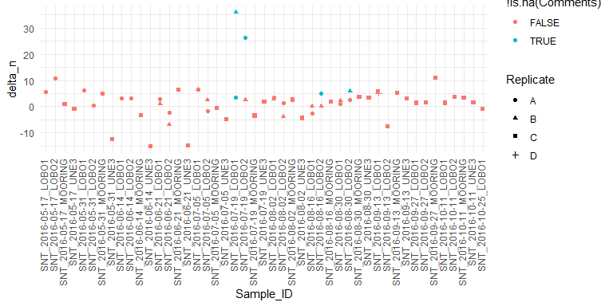

Stable Isotope Data
================

-   [C N Data and Stable Isotope
    Data](#c-n-data-and-stable-isotope-data)
-   [Data Prevalence](#data-prevalence)
    -   [Review of Delta\_N data](#review-of-delta_n-data)
-   [Calculate Average Values](#calculate-average-values)
    -   [Graphic Exploration of Site and
        Date](#graphic-exploration-of-site-and-date)
        -   [Delta N Data](#delta-n-data)
        -   [Delta C Data](#delta-c-data)
    -   [Quick Models](#quick-models)
        -   [Delta N Model](#delta-n-model)
        -   [Delta\_C Model](#delta_c-model)


\#Introduction In this notebook I am looking at the stable isotope data
and doing some very lightweight modeling, looking principally at
seasonal patterns.

\#Load Libraries

``` r
library(tidyverse)
#> -- Attaching packages --------------------------------------- tidyverse 1.3.1 --
#> v ggplot2 3.3.5     v purrr   0.3.4
#> v tibble  3.1.6     v dplyr   1.0.7
#> v tidyr   1.1.4     v stringr 1.4.0
#> v readr   2.1.1     v forcats 0.5.1
#> -- Conflicts ------------------------------------------ tidyverse_conflicts() --
#> x dplyr::filter() masks stats::filter()
#> x dplyr::lag()    masks stats::lag()
library(readxl)

library(emmeans)

theme_set(theme_minimal())
```

# C N Data and Stable Isotope Data

This is found in two different Tabs. It appears these are some replicate
analyses here, labeled in confusing ways….

The Elemental N and C values are labeled as “not blank corrected”. I am
not sure whether they should be blank corrected, and if so, how to do so
correctly. My tendency would be to “correct” by the mean value of the
blanks. This would have a small effect on elemental carbon, but a
sizable effect on elemental nitrogen.

But because of these uncertainties, I focus only on the stable isotope
values.

`Sample_ID` codes do NOT match the `Sample_ID` codes from other tabs.
The difference is small, but would interfere with matches. We correct
them here.

``` r
POC1_data <- read_excel("SEANET_Phyto Data_Bigelow.xlsx", 
                        sheet = "POC1", skip = 11, n_max = 30) %>%
  rename(Sample_ID = `Sample ID`) %>%
  mutate(Replicate = substr(Sample_ID, nchar(Sample_ID), nchar(Sample_ID)),
         Sample_ID = substr(Sample_ID, 1, nchar(Sample_ID)-2)) %>%
  relocate(Replicate, .after = 'Sample_ID') %>%
  select(c(1,2,9,10, 11))
  
names(POC1_data)[3] <- 'Delta_N'
names(POC1_data)[4] <- 'Delta_C'
```

``` r
POC2_data <- read_excel("SEANET_Phyto Data_Bigelow.xlsx", 
                        sheet = "POC2", skip = 11, n_max = 30) %>%
  rename(Sample_ID = `Sample ID`) %>%
  mutate(Replicate = 'C') %>%
  relocate(Replicate, .after = 'Sample_ID') %>%
  select(c(1,2,10, 11, 12))

POC2_data$Replicate[19] <- 'D'  # Only apparent duplicate in second round of analysis

names(POC2_data)[3] <- 'Delta_N'
names(POC2_data)[4] <- 'Delta_C'
```

``` r
POC_data <- POC1_data %>%
  bind_rows(POC2_data) %>%
  mutate(date = as.Date(substr(Sample_ID, 1,10)),
         site = substr(Sample_ID, 12, nchar(Sample_ID))) %>%
  mutate(Sample_ID = paste0('SNT_', Sample_ID)) %>%
  relocate(date, site, .after = Sample_ID)
```

``` r
rm(POC1_data, POC2_data)
```

# Data Prevalence

``` r
xtabs(~ date + site, data = POC_data)
#>             site
#> date         LOBO1 LOBO2 MOORING UNE3
#>   2016-05-17     1     1       1    1
#>   2016-05-31     1     1       1    1
#>   2016-06-14     1     1       1    1
#>   2016-06-21     2     2       1    1
#>   2016-07-05     2     2       1    1
#>   2016-07-19     2     2       1    1
#>   2016-08-02     2     2       1    1
#>   2016-08-16     2     2       1    0
#>   2016-08-30     2     2       1    1
#>   2016-09-13     2     1       1    1
#>   2016-09-27     1     1       1    0
#>   2016-10-11     1     1       1    1
#>   2016-10-25     1     0       0    0
```

Note that I have no geographic data on the Mooring site.

## Review of Delta\_N data

``` r
ggplot(POC_data, aes(Sample_ID, Delta_N)) +
  geom_point(aes(color = ! is.na(Comments), shape = Replicate)) +
  theme(axis.text.x = element_text(angle = 90, hjust = 1, vjust = 0.2))
```



We see two outliers, both of which were flagged in the analytic results
as “unusually high.” While there is no other indication of WHY they are
so high, I will omit them from further analysis. Note that I chose to
drop only the Delta\_N values, not the related Delta\_C values. I do not
know enough about lab procedures to be sure that is correct.

``` r
POC_data <- POC_data %>%
  mutate(Delta_N = if_else(row_number() %in% c(16,17), NA_real_, Delta_N))
```

# Calculate Average Values

``` r
POC_data_sum <- POC_data %>%
  group_by(Sample_ID) %>%
  summarize(Delta_N_mean = mean(Delta_N, na.rm = TRUE),
            Delta_N_SD =   sd(Delta_N, na.rm = TRUE),
            Deta_N_n  =    sum(! is.na(Delta_N)),
            Delta_C_mean = mean(Delta_C, na.rm = TRUE),
            Delta_C_SD =   sd(Delta_C, na.rm = TRUE),
            Deta_C_n  =    sum(! is.na(Delta_C)))
```

We have only a single measurement of most samples, yet the standard
errors are fairly large for those samples where we **do** have
replicates. Careful analysis would estimate standard errors even for
those samples with only a single analysis based on the error in the
samples for which we have multiple laboratory results.

## Graphic Exploration of Site and Date

### Delta N Data

``` r
POC_data_test <- POC_data %>%
  select(-Comments) %>%
  mutate(site = factor(site),
         date_factor = factor(date))
```

``` r
ggplot(POC_data_test, aes(date, Delta_N)) +
  geom_line(aes(color = site)) +
  theme(axis.text.x = element_text(angle = 90, hjust = 1, vjust = 0.2))
```


### Delta C Data

``` r
ggplot(POC_data_test, aes(date, Delta_C)) +
  geom_line(aes(color = site)) +
  theme(axis.text.x = element_text(angle = 90, hjust = 1, vjust = 0.2))
```


So, looking at Carbon, it looks like late summer samples tend to be high
Delta C.

## Quick Models

### Delta N Model

``` r
delta_N_lm <- lm(Delta_N ~ site * date_factor,  data = POC_data_test)
anova(delta_N_lm)
#> Analysis of Variance Table
#> 
#> Response: Delta_N
#>                  Df Sum Sq Mean Sq F value   Pr(>F)    
#> site              3 384.03 128.010 24.7683 3.41e-05 ***
#> date_factor      12 268.89  22.407  4.3356 0.010560 *  
#> site:date_factor 31 819.74  26.443  5.1165 0.003281 ** 
#> Residuals        11  56.85   5.168                     
#> ---
#> Signif. codes:  0 '***' 0.001 '**' 0.01 '*' 0.05 '.' 0.1 ' ' 1
```

``` r
emmip(delta_N_lm, site ~ date_factor)
#> Warning: Removed 5 rows containing missing values (geom_point).
#> Warning: Removed 3 row(s) containing missing values (geom_path).
```


So, what jumps out is the UNE site, in the spring, is doing something
very different. The UNE site is on the Saco, so likely dominated by
freshwater runoff in the spring. I tend to believe just about everything
else is just noise, but it is hard to tell from this plot alone.

### Delta\_C Model

``` r
delta_C_lm <- lm(Delta_C ~ site * date_factor,  data = POC_data_test)
anova(delta_C_lm)
#> Analysis of Variance Table
#> 
#> Response: Delta_C
#>                  Df  Sum Sq Mean Sq F value    Pr(>F)    
#> site              3  16.697  5.5657  9.7369  0.001232 ** 
#> date_factor      12 134.129 11.1775 19.5544 2.315e-06 ***
#> site:date_factor 31  72.544  2.3401  4.0940  0.004803 ** 
#> Residuals        13   7.431  0.5716                      
#> ---
#> Signif. codes:  0 '***' 0.001 '**' 0.01 '*' 0.05 '.' 0.1 ' ' 1
```

``` r
emmip(delta_C_lm, site ~ date_factor)
#> Warning: Removed 5 rows containing missing values (geom_point).
#> Warning: Removed 3 row(s) containing missing values (geom_path).
```


So here we see a stronger seasonal pattern at all sites, again with UNE
doing something slightly different, and possibly the Mooring also doing
something.
