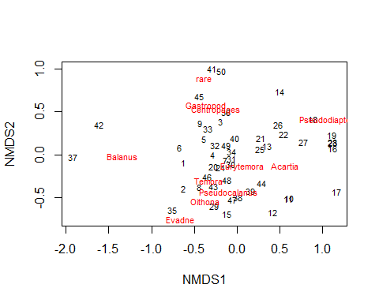
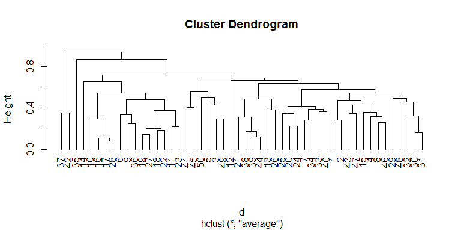
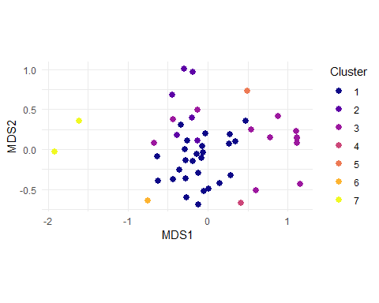
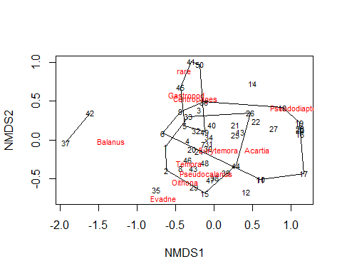
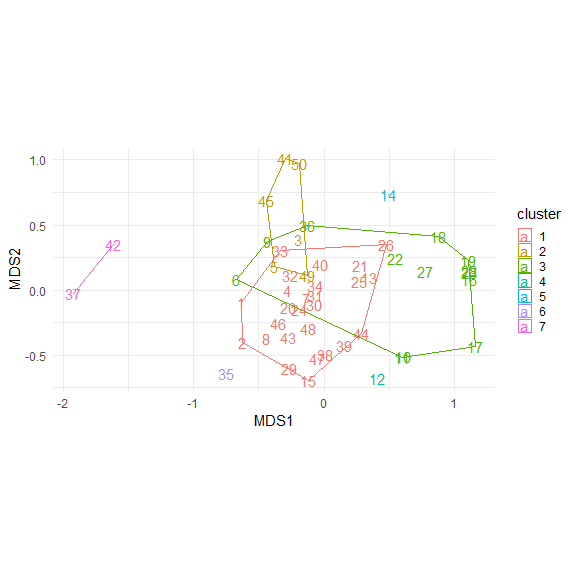
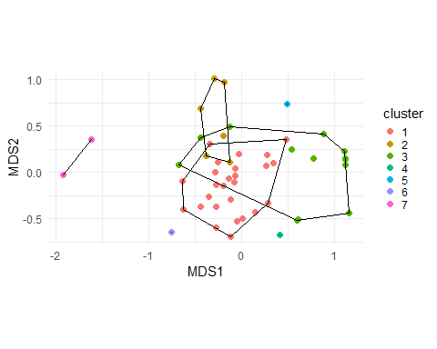

Examining Zooplankton Data File
================
Curtis C. Bohlen, Casco Bay Estuary Partnership

-   [Load Libraries](#load-libraries)
-   [Load Data](#load-data)
    -   [Community Data Matrix](#community-data-matrix)
-   [Two rows of Balanus from one
    sample.](#two-rows-of-balanus-from-one-sample)
    -   [Reorder columns by mean count](#reorder-columns-by-mean-count)
    -   [Default 2-D NMDS](#default-2-d-nmds)
-   [Cluster Analysis](#cluster-analysis)
    -   [Plot Clusters](#plot-clusters)
-   [Finer Control of Graphics](#finer-control-of-graphics)
    -   [Understanding `ordihull()`](#understanding-ordihull)
    -   [Plot Clusters and Convex
        Hulls](#plot-clusters-and-convex-hulls)


\#Introduction In this notebook, I am taking a first stab at zooplankton
community analysis. We look principally at Non-metric multidimensional
scaling and cluster analysis. We rely on the `vegan` package for most of
the underlying tools.

# Load Libraries

``` r
library(tidyverse)
#> -- Attaching packages --------------------------------------- tidyverse 1.3.1 --
#> v ggplot2 3.3.5     v purrr   0.3.4
#> v tibble  3.1.6     v dplyr   1.0.7
#> v tidyr   1.1.4     v stringr 1.4.0
#> v readr   2.1.1     v forcats 0.5.1
#> -- Conflicts ------------------------------------------ tidyverse_conflicts() --
#> x dplyr::filter() masks stats::filter()
#> x dplyr::lag()    masks stats::lag()
library(readxl)

library(vegan)
#> Loading required package: permute
#> Loading required package: lattice
#> This is vegan 2.5-7

theme_set(theme_minimal())
```

# Load Data

``` r
zoopl_data_long <- read_excel("Seanet ALL DATA FILE.xlsx", 
    sheet = "Zoop_Composition") %>%
  arrange(Estuary, STATION, DATE)
```

### Community Data Matrix

``` r
zoopl_community <- zoopl_data_long %>%
  mutate(new_id = paste(Estuary, STATION, DATE, sep = '_')) %>%
  rename(count = `QUANTITY`,
         name = NAME) %>%
  select(new_id, name, count)
```

We saw one double entered value: for Balanus on

Bagaduce\_2\_2017-07-19

With that in the data set, it has trouble making a community matrix. We
correct by adding the two Balanus entries together. That needs to be
confirmed.

# Two rows of Balanus from one sample.

``` r
zoopl_community$count[18] <- (35 + 29)/2
zoopl_community <- zoopl_community[-19,]
```

``` r
  zoopl_community <- zoopl_community%>%
  pivot_wider(names_from = name, values_from = count, values_fill = 0)
```

### Reorder columns by mean count

``` r
my_order <- zoopl_community %>%
  summarize(across(c(-1), mean)) %>%
  unlist %>%
  sort(decreasing = TRUE) %>%
  names
my_order
#>  [1] "Acartia"         "Pseudocalanus"   "Eurytemora"      "Centropages"    
#>  [5] "Balanus"         "Temora"          "Gastropod"       "Evadne"         
#>  [9] "Pseudodiaptomus" "Oithona"         "Membranipora"    "Oikopleura"     
#> [13] "Tortanus"        "Obelia"          "Podonidae"       "Bivalve"        
#> [17] "Crangon"         "Bougainvillia"
```

``` r
zoopl_community <- zoopl_community %>%
  select(new_id, all_of(my_order))
zoopl_community
#> # A tibble: 50 x 19
#>    new_id  Acartia Pseudocalanus Eurytemora Centropages Balanus Temora Gastropod
#>    <chr>     <dbl>         <dbl>      <dbl>       <dbl>   <dbl>  <dbl>     <dbl>
#>  1 Bagadu~      55           103          0         116      32      0        32
#>  2 Bagadu~      50           126          0          64      79      0         0
#>  3 Bagadu~      41           147          0         154       0      0         0
#>  4 Bagadu~      67           104         83          40      32      0         0
#>  5 Bagadu~      45            41         31         106      15      0        17
#>  6 Bagadu~     211            42          0           0      81     48       134
#>  7 Bagadu~     297            72         62          79      53      0         0
#>  8 Bagadu~      98           116         33           0      94     50         0
#>  9 Bagadu~     150             0         33          32      38      0        83
#> 10 Bagadu~     772            49          0           0       0      0         0
#> # ... with 40 more rows, and 11 more variables: Evadne <dbl>,
#> #   Pseudodiaptomus <dbl>, Oithona <dbl>, Membranipora <dbl>, Oikopleura <dbl>,
#> #   Tortanus <dbl>, Obelia <dbl>, Podonidae <dbl>, Bivalve <dbl>,
#> #   Crangon <dbl>, Bougainvillia <dbl>
```

## Default 2-D NMDS

This generally fails to converge.

``` r
NMDS_default <- metaMDS(zoopl_community[,-1], k = 2, autotransform = TRUE,
                        maxit = 50, trymax = 50)
#> Square root transformation
#> Wisconsin double standardization
#> Run 0 stress 0.205402 
#> Run 1 stress 0.2048711 
#> ... New best solution
#> ... Procrustes: rmse 0.09486153  max resid 0.2776757 
#> Run 2 stress 0.1886686 
#> ... New best solution
#> ... Procrustes: rmse 0.07037083  max resid 0.2409328 
#> Run 3 stress 0.2135785 
#> Run 4 stress 0.1886024 
#> ... New best solution
#> ... Procrustes: rmse 0.02757016  max resid 0.1180147 
#> Run 5 stress 0.2067008 
#> Run 6 stress 0.1998152 
#> Run 7 stress 0.20853 
#> Run 8 stress 0.1978532 
#> Run 9 stress 0.1853602 
#> ... New best solution
#> ... Procrustes: rmse 0.05351339  max resid 0.2410094 
#> Run 10 stress 0.1891529 
#> Run 11 stress 0.202062 
#> Run 12 stress 0.2205635 
#> Run 13 stress 0.1969244 
#> Run 14 stress 0.202349 
#> Run 15 stress 0.1875216 
#> Run 16 stress 0.1898866 
#> Run 17 stress 0.1875232 
#> Run 18 stress 0.1867918 
#> Run 19 stress 0.2076788 
#> Run 20 stress 0.1929839 
#> Run 21 stress 0.2220053 
#> Run 22 stress 0.1995011 
#> Run 23 stress 0.2164155 
#> Run 24 stress 0.2078133 
#> Run 25 stress 0.1950509 
#> Run 26 stress 0.1875424 
#> Run 27 stress 0.1988306 
#> Run 28 stress 0.208625 
#> Run 29 stress 0.1924163 
#> Run 30 stress 0.2035824 
#> Run 31 stress 0.2005931 
#> Run 32 stress 0.2094047 
#> Run 33 stress 0.2031234 
#> Run 34 stress 0.2056254 
#> Run 35 stress 0.1868907 
#> Run 36 stress 0.1965627 
#> Run 37 stress 0.1908303 
#> Run 38 stress 0.1917965 
#> Run 39 stress 0.2007128 
#> Run 40 stress 0.2171635 
#> Run 41 stress 0.1901504 
#> Run 42 stress 0.2096276 
#> Run 43 stress 0.2052599 
#> Run 44 stress 0.2004647 
#> Run 45 stress 0.1991416 
#> Run 46 stress 0.1919093 
#> Run 47 stress 0.2162771 
#> Run 48 stress 0.184877 
#> ... New best solution
#> ... Procrustes: rmse 0.01881288  max resid 0.1015829 
#> Run 49 stress 0.2013058 
#> Run 50 stress 0.1911624 
#> *** No convergence -- monoMDS stopping criteria:
#>     50: no. of iterations >= maxit
```

IN an effort to get this to converge, we can pool the less common
species into a “rare” pseudo-species. An alternative is to drop them
entirely.

``` r
zoopl_trim <- zoopl_community %>%
  column_to_rownames(var = "new_id") %>%
  rowwise() %>%
  mutate(rare = sum(c(Membranipora, Oikopleura, Tortanus, Obelia, 
                      Podonidae, Bivalve, Crangon, Bougainvillia))) %>%
  select(-c(Membranipora :  Bougainvillia)) 
```

This also sometimes fails to converge, and sometimes does converge. I
use `set.seed()` here just to ensure we come back with one of the ones
that does converge.

``` r
set.seed(54321)
NMDS_trim <- metaMDS(zoopl_trim, autotransform = TRUE,
                        maxit = 100, trymax = 50)
#> Square root transformation
#> Wisconsin double standardization
#> Run 0 stress 0.2048293 
#> Run 1 stress 0.1954844 
#> ... New best solution
#> ... Procrustes: rmse 0.07661131  max resid 0.1965559 
#> Run 2 stress 0.2211269 
#> Run 3 stress 0.1954965 
#> ... Procrustes: rmse 0.002886941  max resid 0.0118807 
#> Run 4 stress 0.198231 
#> Run 5 stress 0.2072736 
#> Run 6 stress 0.2078279 
#> Run 7 stress 0.1983644 
#> Run 8 stress 0.198997 
#> Run 9 stress 0.1989538 
#> Run 10 stress 0.2041129 
#> Run 11 stress 0.1952331 
#> ... New best solution
#> ... Procrustes: rmse 0.008627627  max resid 0.04235529 
#> Run 12 stress 0.2164094 
#> Run 13 stress 0.1952331 
#> ... New best solution
#> ... Procrustes: rmse 0.0001160009  max resid 0.0005749188 
#> ... Similar to previous best
#> Run 14 stress 0.1982984 
#> Run 15 stress 0.199219 
#> Run 16 stress 0.2041276 
#> Run 17 stress 0.1982394 
#> Run 18 stress 0.2016003 
#> Run 19 stress 0.2123235 
#> Run 20 stress 0.219074 
#> *** Solution reached
```

``` r
plot(NMDS_trim, type = 't')
```



# Cluster Analysis

``` r
d <- vegdist(zoopl_trim, "bray") # Bray-Curtis default 
clust <- hclust(d, method = 'average')          # This is agglomerative clustering - build the groups
                            # from a single observation not split them apart...
cut7 <- cutree(clust, 7)    # this cut number is arbitrary
```

``` r
plot(clust, hang = -1)
```



``` r
plot_data <- data.frame(NMDS_trim$points) %>%
    mutate(id = zoopl_community$new_id)
```

## Plot Clusters

``` r
plot_data <- plot_data %>%
  mutate(cluster = factor(cut7),
         row = row_number())

plt <- ggplot(data = plot_data, aes(MDS1, MDS2)) + 
  geom_point(aes(color = cluster), size = 2.5) +
  scale_color_viridis_d(option = 'C', name = 'Cluster') +
  coord_fixed()
plt
```



``` r
plot(NMDS_trim, type = 't')
hull <- ordihull(NMDS_trim, groups = cut7, display = "sites")
```



The ordination largely pulls out a couple of high Balanus samples.
Everything else is a bit of a jumble. The problem here is that Balanus
has some very high variability – not found in every sample – so this may
not be all that informative.

# Finer Control of Graphics

To get greater control over these plots, we need to move all this to
`ggplot()`.

## Understanding `ordihull()`

`vegan` is built largely on S3 classes. Here, the underlying
implementation is based on a named list, , so it’s easy to find a
starting point by looking at the names in the object returned by
`ordihull()`.

``` r
class(hull)
#> [1] "ordihull"
names(hull)
#> [1] "1" "2" "3" "4" "5" "6" "7"
```

I doubt it is a coincidence that the list has eight objects and we
defined eight clusters. We look at the first item in this list.

``` r
class(hull[[1]])
#> [1] "matrix" "array"
hull[[1]]
#>         NMDS1       NMDS2
#> 44  0.2840132 -0.33101609
#> 15 -0.1169403 -0.69146690
#> 2  -0.6261503 -0.39936270
#> 1  -0.6315484 -0.09161072
#> 33 -0.3375338  0.30357377
#> 26  0.4777405  0.35246918
#> 44  0.2840132 -0.33101609
```

It’s just an array containing the points of the vertexes of the
polygons. Each polygon is passed as an array of points. We can work with
that, although it is going to be easier to “flatten” the data structure.

We need to convert each array to a data frame (tibble) and append them,
retaining their cluster identities. This can be done in several ways.
Here I convert the arrays to tibbles, then bind them into one tibble
with `bind_rows()`, which conveniently allows you to label each entry
with the source data frame (here the cluster number).

``` r
hullsdfs <- map(hull, as_tibble) # Creates a list of tibbles
hulls_df <- hullsdfs %>%
  bind_rows(.id = 'Cluster')  # converts number in the list to a variable
hulls_df
#> # A tibble: 30 x 3
#>    Cluster  NMDS1   NMDS2
#>    <chr>    <dbl>   <dbl>
#>  1 1        0.284 -0.331 
#>  2 1       -0.117 -0.691 
#>  3 1       -0.626 -0.399 
#>  4 1       -0.632 -0.0916
#>  5 1       -0.338  0.304 
#>  6 1        0.478  0.352 
#>  7 1        0.284 -0.331 
#>  8 2       -0.130  0.110 
#>  9 2       -0.384  0.182 
#> 10 2       -0.441  0.685 
#> # ... with 20 more rows
```

## Plot Clusters and Convex Hulls

``` r
plt <- ggplot(data = plot_data, aes(MDS1, MDS2)) + 
  #geom_point(aes(color = cluster), size = 1.25) +
  geom_text(aes(label = row, color = cluster), size = 4) +
  geom_polygon(data=hulls_df,  
               mapping = aes(x= NMDS1,y= NMDS2, group = Cluster,
                             color = Cluster),
               #color = 'black',
               fill = NA) + 
 # scale_color_viridis_d(option = 'B', name = 'Cluster') +
  
  # Adjust size of legend
  theme(legend.key.size = unit(0.35, 'cm')) +
  
  # Set aspect ratio (defaults to 1)
  coord_fixed() 
plt
```



What jumps out is that most observations fall into a central cluster. A
few of the other, smaller clusters consist of a couple of sequential
observations, suggesing several of the clusters are sequentially close
observations, which suggests a strong pattern to these data, if only we
can figure out what it is….

``` r
plt <- ggplot(data = plot_data, aes(MDS1, MDS2)) + 
  geom_point(aes(color = cluster), size = 2) +
  geom_polygon(data=hulls_df,  
               mapping = aes(x= NMDS1,y= NMDS2, group = Cluster),
               color = 'black', fill = NA) + 
  #scale_color_viridis_d(option = 'C', name = 'Cluster') +
  
  # Adjust size of legend
  theme(legend.key.size = unit(0.35, 'cm')) +
  
  # Set aspect ratio (defaults to 1)
  coord_fixed() 
plt
```



Cluster 3 does not align all that well with the ordination. Note that
several clusters consist of only a single sample. Overall, the cluster
analysis here is not proving all that helpful.
