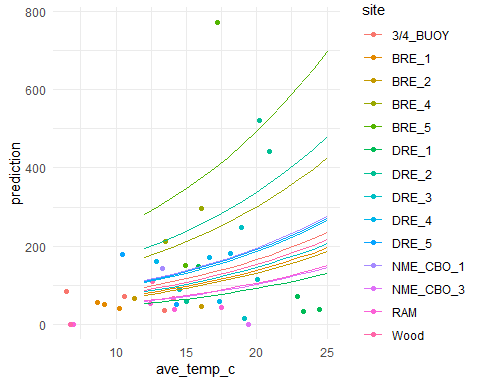

Examining Zooplankton Data File
================
Curtis C. Bohlen, Casco Bay Estuary Partnership

-   [Load Libraries](#load-libraries)
-   [Load Data](#load-data)
    -   [Community Data Matrix](#community-data-matrix)
    -   [Two rows of **Balanus** from one
        sample](#two-rows-of-balanus-from-one-sample)
        -   [Reorder columns by mean
            count](#reorder-columns-by-mean-count)
-   [Load Environmental Data](#load-environmental-data)
    -   [Select the Subset of Predictors to
        Analyze](#select-the-subset-of-predictors-to-analyze)
    -   [Review Prevalence of Environmental
        Data](#review-prevalence-of-environmental-data)
        -   [Surface Salinity data is
            available](#surface-salinity-data-is-available)
        -   [Downcast Temperature Data is
            Available](#downcast-temperature-data-is-available)
-   [Combine the data](#combine-the-data)
-   [Quick data summaries](#quick-data-summaries)
-   [Graphical Data Review](#graphical-data-review)
    -   [Pairs Plot](#pairs-plot)
    -   [Histogram](#histogram)
    -   [Sites](#sites)
    -   [Seasonal](#seasonal)
    -   [Salinity](#salinity)
    -   [Salinity Gradient](#salinity-gradient)
    -   [Temperature](#temperature)
    -   [Temperature Gradient](#temperature-gradient)
-   [Generalized Additive Mixed Models for
    Acartia](#generalized-additive-mixed-models-for-acartia)
    -   [Full Model](#full-model)
        -   [Poisson Model](#poisson-model)
        -   [Quasipoisson Model](#quasipoisson-model)
        -   [Negative Binomial](#negative-binomial)
        -   [Gaussian Model](#gaussian-model)
-   [Compare Model Predictions](#compare-model-predictions)
    -   [Quasipoisson Model
        Predictions](#quasipoisson-model-predictions)
    -   [Negative Binomial Model
        Predictions](#negative-binomial-model-predictions)
    -   [Gaussian Binomial Model
        Predictions](#gaussian-binomial-model-predictions)
-   [Reduced Models](#reduced-models)


\#Introduction In this notebook, I am taking a first stab at zooplankton
community analysis. I am testing methods for analyzing
species-by-species responses to environmental predictors.

I rely principally on “General Additive Models”, or “GAM” models, from
the `mgcv` package. A GAM model is a generalization of a “Generalized
Linear Model” or GLM, which does some fancy fitting in the background to
allow much of the machinery of GLMs to be applied in the context of
non-linear relationships between dependent and independent variables.

GAMs are a powerful tool, but they add complexity to model development,
especially in a multivariate regression setting. For this reason, it is
important to use the tool sparingly, informed by good scientific logic,
and clarity of thinking about the hypotheses you wish to test.

I am by no means an expert on GAM modeling, but in my limited
experience, it is a good idea to use parsimonious models whenever
possible. I find GAMs can happily fit “significant” models, or models
with good AIC properties that are almost baroque in their complexity. At
that point, the models may be good for prediction, and yet offer little
in the way of intuitive understanding of ecological processes that
matter.

The layout of this Notebook proceeds as follows:

1.  Load data direct from the data files you shared with me, and
    “correct” those data on the fly, so any changes I make are clearly
    documented. I load only a subset of the environmental data, because
    my purpose here is to show how to conduct the analyses, not DO the
    analyses. I don’t understand the studies well enough yet to run any
    real analyses….

2.  Select a limited subset of the zooplankton data, focusing on the
    five most abundant species.

3.  Develop graphic summaries of the data to help hone my intuition
    about what the data may say.

4.  COnduct analyses of ACARTIA only, using GAM models.

# Load Libraries

``` r
library(tidyverse)
#> -- Attaching packages --------------------------------------- tidyverse 1.3.1 --
#> v ggplot2 3.3.5     v purrr   0.3.4
#> v tibble  3.1.6     v dplyr   1.0.7
#> v tidyr   1.1.4     v stringr 1.4.0
#> v readr   2.1.1     v forcats 0.5.1
#> -- Conflicts ------------------------------------------ tidyverse_conflicts() --
#> x dplyr::filter() masks stats::filter()
#> x dplyr::lag()    masks stats::lag()
library(readxl)

library(GGally)
#> Registered S3 method overwritten by 'GGally':
#>   method from   
#>   +.gg   ggplot2

library(mgcv)
#> Loading required package: nlme
#> 
#> Attaching package: 'nlme'
#> The following object is masked from 'package:dplyr':
#> 
#>     collapse
#> This is mgcv 1.8-38. For overview type 'help("mgcv-package")'.
library(emmeans)
#> 
#> Attaching package: 'emmeans'
#> The following object is masked from 'package:GGally':
#> 
#>     pigs

theme_set(theme_minimal())
```

# Load Data

``` r
zoopl_data_long <- read_excel("Seanet ALL DATA FILE.xlsx", 
    sheet = "Zoop_Composition") %>%
  arrange(Estuary, STATION, DATE)
```

### Community Data Matrix

I spend a fair amount of time here trying to construct consistent sample
ID codes so I can join the zooplankton and environmental data together
correctly. I’ve made a BUNCH of assumptions here, and I don’t know if
they are correct or not.

``` r
zoopl_community <- zoopl_data_long %>%
  mutate(new_id = paste(Estuary, STATION, DATE, sep = '_'),
         new_id = gsub("New Meadows", "NME CBO", new_id),
         new_id = gsub("Bagaduce", "BRE", new_id),
         new_id = gsub("Saco_1", "RAM", new_id),
         new_id = gsub("Saco_2", "Wood", new_id),
         new_id = gsub("Saco_3", "3/4 BUOY", new_id),
         new_id = gsub(" ", "_", new_id)) %>%
  rename(count = `QUANTITY`,
         name = NAME) %>%
  select(new_id, name, count)
```

We saw one double entered value: for *Balanus* on

Bagaduce\_2\_2017-07-19

With that in the data set, it has trouble making a community matrix. We
correct by averaging the two *Balanus* entries. That needs to be
confirmed.

## Two rows of **Balanus** from one sample

``` r
zoopl_community[c(18,19),] 
#> # A tibble: 2 x 3
#>   new_id           name    count
#>   <chr>            <chr>   <dbl>
#> 1 BRE_2_2017-07-19 Balanus    29
#> 2 BRE_2_2017-07-19 Balanus    35

zoopl_community$count[18] <- (35 + 29)/2
zoopl_community <- zoopl_community[-19,]
```

``` r
  zoopl_community <- zoopl_community %>%
  pivot_wider(names_from = name, values_from = count, values_fill = 0)
```

### Reorder columns by mean count

``` r
my_order <- zoopl_community %>%
  summarize(across(c(-1), mean)) %>%
  unlist %>%
  sort(decreasing = TRUE) %>%
  names
my_order
#>  [1] "Acartia"         "Pseudocalanus"   "Eurytemora"      "Centropages"    
#>  [5] "Balanus"         "Temora"          "Gastropod"       "Evadne"         
#>  [9] "Pseudodiaptomus" "Oithona"         "Membranipora"    "Oikopleura"     
#> [13] "Tortanus"        "Obelia"          "Podonidae"       "Bivalve"        
#> [17] "Crangon"         "Bougainvillia"
```

We focus on the five most abundant species.

``` r
zoopl_community <- zoopl_community %>%
  select(new_id, all_of(my_order)) %>%
  select(1:6) %>%
  arrange(new_id)
zoopl_community
#> # A tibble: 50 x 6
#>    new_id              Acartia Pseudocalanus Eurytemora Centropages Balanus
#>    <chr>                 <dbl>         <dbl>      <dbl>       <dbl>   <dbl>
#>  1 3/4_BUOY_2016-05-18      85            91         22           0      51
#>  2 3/4_BUOY_2016-06-15      71            75         29           0       0
#>  3 3/4_BUOY_2016-07-20      26           215         30          24       0
#>  4 3/4_BUOY_2016-08-03     130           158         69         257       0
#>  5 3/4_BUOY_2016-10-12      35             0          0         414       0
#>  6 BRE_1_2017-06-21         55           103          0         116      32
#>  7 BRE_1_2017-07-19         50           126          0          64      79
#>  8 BRE_1_2017-08-17         41           147          0         154       0
#>  9 BRE_2_2017-07-19         67           104         83          40      32
#> 10 BRE_2_2017-08-17         45            41         31         106      15
#> # ... with 40 more rows
```

# Load Environmental Data

There are far too many potential environmental predictor variables here
to make me comfortable with any sort of a multiple regression stepwise
modeling approach. I selected a few predictors to work with, to show the
general strategy.

Again, we have to spend a little time fixing inconsistencies in how
samples were labeled. Again, my assumptions need to be checked and
confirmed.

``` r
enviro_data <- read_excel("Seanet ALL DATA FILE.xlsx", 
    sheet = "Phyto_Enviromental", range = "a1:an53") %>%
  rename_with(.fn = ~sub(" *$", "", .x) ) %>%
  mutate(new_id = gsub(' ', '_', paste(ID, date, sep = '_')),
         new_id = gsub('CBO1', 'CBO_1', new_id),
         new_id = gsub('CBO2', 'CBO_2', new_id),
         new_id = gsub('CBO3', 'CBO_3', new_id),) %>%
  rename_with(.fn = ~gsub(" ", "_", .x)) %>%
  select(-c(riv_km:tide_height)) %>%
  relocate(new_id) %>%
  arrange(new_id)    # this does not align everything correctly
```

## Select the Subset of Predictors to Analyze

Time of year, salinity and temperature data are most consistently
available, so we initially focus on those as potential predictors. We
will pick up some predictors from the phytoplankton data later.

``` r
enviro_data <- enviro_data %>%
  select(new_id, date, sst, contains('temp'), contains('sal')) %>%
  mutate(across(ave_temp_c:sal.gradient, as.numeric)) %>%
  pivot_longer(sst:temp.gradient, names_to = 'type', values_to = 'value') %>%
  filter(! is.na(value)) %>%
  pivot_wider(names_from = type, values_from = 'value')
#> Warning in mask$eval_all_mutate(quo): NAs introduced by coercion

#> Warning in mask$eval_all_mutate(quo): NAs introduced by coercion

#> Warning in mask$eval_all_mutate(quo): NAs introduced by coercion

#> Warning in mask$eval_all_mutate(quo): NAs introduced by coercion

#> Warning in mask$eval_all_mutate(quo): NAs introduced by coercion

#> Warning in mask$eval_all_mutate(quo): NAs introduced by coercion

#> Warning in mask$eval_all_mutate(quo): NAs introduced by coercion

#> Warning in mask$eval_all_mutate(quo): NAs introduced by coercion
```

``` r
enviro_data
#> # A tibble: 49 x 14
#>    new_id       date                salinity ave_sal_psu sur.sal bot.sal max.sal
#>    <chr>        <dttm>                 <dbl>       <dbl>   <dbl>   <dbl>   <dbl>
#>  1 3/4_BUOY_20~ 2016-05-18 00:00:00       32        7.76    4.99    8.94    8.94
#>  2 3/4_BUOY_20~ 2016-06-15 00:00:00       30       31.5    31.7    31.9    31.9 
#>  3 3/4_BUOY_20~ 2016-07-20 00:00:00       33       NA      NA      NA      NA   
#>  4 3/4_BUOY_20~ 2016-08-03 00:00:00       31       NA      NA      NA      NA   
#>  5 3/4_BUOY_20~ 2016-10-12 00:00:00       33       32.3    31.8    32.6    32.6 
#>  6 BRE_1_2017-~ 2017-06-21 00:00:00       NA       30.4    27.4    30.8    30.8 
#>  7 BRE_1_2017-~ 2017-07-19 00:00:00       NA       31.0    28.0    31.1    31.3 
#>  8 BRE_1_2017-~ 2017-08-17 00:00:00       NA       31.0    30.8    31.1    31.2 
#>  9 BRE_2_2017-~ 2017-07-19 00:00:00       NA       31.1    32.6    30.7    32.6 
#> 10 BRE_2_2017-~ 2017-08-17 00:00:00       NA       30.7    30.8    30.6    30.9 
#> # ... with 39 more rows, and 7 more variables: sal.gradient <dbl>, sst <dbl>,
#> #   ave_temp_c <dbl>, sur_temp <dbl>, bot.temp <dbl>, max.temp <dbl>,
#> #   temp.gradient <dbl>
```

``` r
test <- enviro_data %>%
  select(-contains('sur'), -contains('bot.'), -contains('max.')) %>%
  mutate(year  = as.numeric(format(date, format = '%Y')),
         month = as.numeric(format(date, format = '%m')),
         month = factor(month, levels = 1:12, labels = month.abb ),
         doy = as.numeric(format(date, format = '%j'))) %>%
  mutate(site = substr(new_id, 1, nchar(new_id)-11)) %>%
  relocate(year, month, doy, .after = date) %>%
  relocate(site, .after = new_id)
test
#> # A tibble: 49 x 12
#>    new_id      site   date                 year month   doy salinity ave_sal_psu
#>    <chr>       <chr>  <dttm>              <dbl> <fct> <dbl>    <dbl>       <dbl>
#>  1 3/4_BUOY_2~ 3/4_B~ 2016-05-18 00:00:00  2016 May     139       32        7.76
#>  2 3/4_BUOY_2~ 3/4_B~ 2016-06-15 00:00:00  2016 Jun     167       30       31.5 
#>  3 3/4_BUOY_2~ 3/4_B~ 2016-07-20 00:00:00  2016 Jul     202       33       NA   
#>  4 3/4_BUOY_2~ 3/4_B~ 2016-08-03 00:00:00  2016 Aug     216       31       NA   
#>  5 3/4_BUOY_2~ 3/4_B~ 2016-10-12 00:00:00  2016 Oct     286       33       32.3 
#>  6 BRE_1_2017~ BRE_1  2017-06-21 00:00:00  2017 Jun     172       NA       30.4 
#>  7 BRE_1_2017~ BRE_1  2017-07-19 00:00:00  2017 Jul     200       NA       31.0 
#>  8 BRE_1_2017~ BRE_1  2017-08-17 00:00:00  2017 Aug     229       NA       31.0 
#>  9 BRE_2_2017~ BRE_2  2017-07-19 00:00:00  2017 Jul     200       NA       31.1 
#> 10 BRE_2_2017~ BRE_2  2017-08-17 00:00:00  2017 Aug     229       NA       30.7 
#> # ... with 39 more rows, and 4 more variables: sal.gradient <dbl>, sst <dbl>,
#> #   ave_temp_c <dbl>, temp.gradient <dbl>
```

I notice some pretty substantial discrepancies between salinity and the
downcast salinity observations, especially on 2016-05-18. I’d like to
understand how those came to be so different. Which is likely to be in
error? the temperature values appear more or less consistent. My
tendency is to mistrust those values. These are also our only May
samples, so we analysis results are going to depend crucially on the
correct data here.

## Review Prevalence of Environmental Data

The pattern of collection of environmental data is highly uneven.
Neither the simple surface data grabs nor the data derived from
downcasts are consistently available I want to see what the sample
design for each looks like, independent of the zooplankton data.

### Surface Salinity data is available

We use `salinity` as a surrogate for the surface data suite of
observations, including `sst` and `sechi_depth`.

``` r
sal_dat <- test %>%
  select(new_id, site, date, year, month, salinity) %>%
  filter(! is.na(salinity))
sal_dat
#> # A tibble: 30 x 6
#>    new_id              site     date                 year month salinity
#>    <chr>               <chr>    <dttm>              <dbl> <fct>    <dbl>
#>  1 3/4_BUOY_2016-05-18 3/4_BUOY 2016-05-18 00:00:00  2016 May         32
#>  2 3/4_BUOY_2016-06-15 3/4_BUOY 2016-06-15 00:00:00  2016 Jun         30
#>  3 3/4_BUOY_2016-07-20 3/4_BUOY 2016-07-20 00:00:00  2016 Jul         33
#>  4 3/4_BUOY_2016-08-03 3/4_BUOY 2016-08-03 00:00:00  2016 Aug         31
#>  5 3/4_BUOY_2016-10-12 3/4_BUOY 2016-10-12 00:00:00  2016 Oct         33
#>  6 DRE_2_2016-06-14    DRE_2    2016-06-14 00:00:00  2016 Jun         30
#>  7 DRE_2_2016-07-19    DRE_2    2016-07-19 00:00:00  2016 Jul         31
#>  8 DRE_2_2016-08-02    DRE_2    2016-08-02 00:00:00  2016 Aug         32
#>  9 DRE_2_2016-08-16    DRE_2    2016-08-16 00:00:00  2016 Aug         33
#> 10 DRE_2_2016-08-30    DRE_2    2016-08-30 00:00:00  2016 Aug         32
#> # ... with 20 more rows
```

So all that data is only available from the 2016 data collection.

``` r
xtabs(~ site + month, data = sal_dat)
#>           month
#> site       Jan Feb Mar Apr May Jun Jul Aug Sep Oct Nov Dec
#>   3/4_BUOY   0   0   0   0   1   1   1   1   0   1   0   0
#>   DRE_2      0   0   0   0   0   1   1   3   0   0   0   0
#>   DRE_4      0   0   0   0   0   1   1   3   0   0   0   0
#>   DRE_5      0   0   0   0   0   1   1   3   0   0   0   0
#>   RAM        0   0   0   0   1   1   1   1   0   1   0   0
#>   Wood       0   0   0   0   1   1   1   1   0   1   0   0
```

### Downcast Temperature Data is Available

``` r
down_dat <- test %>%
  select(new_id, site, date, year, month, ave_sal_psu) %>%
  filter(! is.na(ave_sal_psu))
unique(down_dat$year)
#> [1] 2016 2017
xtabs(~ site + month + year, data = down_dat)
#> , , year = 2016
#> 
#>            month
#> site        Jan Feb Mar Apr May Jun Jul Aug Sep Oct Nov Dec
#>   3/4_BUOY    0   0   0   0   1   1   0   0   0   1   0   0
#>   BRE_1       0   0   0   0   0   0   0   0   0   0   0   0
#>   BRE_2       0   0   0   0   0   0   0   0   0   0   0   0
#>   BRE_4       0   0   0   0   0   0   0   0   0   0   0   0
#>   BRE_5       0   0   0   0   0   0   0   0   0   0   0   0
#>   DRE_1       0   0   0   0   0   1   1   2   0   0   0   0
#>   DRE_2       0   0   0   0   0   1   0   2   0   0   0   0
#>   DRE_3       0   0   0   0   0   1   1   2   0   0   0   0
#>   DRE_4       0   0   0   0   0   1   1   2   0   0   0   0
#>   DRE_5       0   0   0   0   0   1   0   1   0   0   0   0
#>   NME_CBO_1   0   0   0   0   0   0   0   0   0   0   0   0
#>   NME_CBO_3   0   0   0   0   0   0   0   0   0   0   0   0
#>   RAM         0   0   0   0   1   1   1   0   0   1   0   0
#>   Wood        0   0   0   0   1   1   0   0   0   1   0   0
#> 
#> , , year = 2017
#> 
#>            month
#> site        Jan Feb Mar Apr May Jun Jul Aug Sep Oct Nov Dec
#>   3/4_BUOY    0   0   0   0   0   0   0   0   0   0   0   0
#>   BRE_1       0   0   0   0   0   1   1   1   0   0   0   0
#>   BRE_2       0   0   0   0   0   0   1   1   0   0   0   0
#>   BRE_4       0   0   0   0   0   1   1   0   0   0   0   0
#>   BRE_5       0   0   0   0   0   1   1   0   0   0   0   0
#>   DRE_1       0   0   0   0   0   0   0   0   0   0   0   0
#>   DRE_2       0   0   0   0   0   0   0   0   0   0   0   0
#>   DRE_3       0   0   0   0   0   0   0   0   0   0   0   0
#>   DRE_4       0   0   0   0   0   0   0   0   0   0   0   0
#>   DRE_5       0   0   0   0   0   0   0   0   0   0   0   0
#>   NME_CBO_1   0   0   0   0   0   0   1   0   0   0   0   0
#>   NME_CBO_3   0   0   0   0   0   0   1   0   0   0   0   0
#>   RAM         0   0   0   0   0   0   0   0   0   0   0   0
#>   Wood        0   0   0   0   0   0   0   0   0   0   0   0
```

So, the big difference is frequency of data availability at the BRE and
NME sites, for which we never have the surface data. Those sites were
principally studied in 2017. It may make sense to treat them as a
different study somehow.

This suggests we may want to restrict analysis to certain data subsets,
depending on availability of predictors.

# Combine the data

``` r
working_data <- test %>%
  inner_join(zoopl_community, by = "new_id") %>%
  mutate(site = factor(site))

long_data <- working_data %>%
  pivot_longer(Acartia:Balanus, names_to = 'Species', values_to = 'Count')
```

# Quick data summaries

``` r
long_data %>%
  group_by(Species) %>%
  summarize(mean = mean(Count), sd = sd(Count), var = var(Count))
#> # A tibble: 5 x 4
#>   Species        mean    sd    var
#>   <chr>         <dbl> <dbl>  <dbl>
#> 1 Acartia       139.  154.  23854.
#> 2 Balanus        21.5  43.6  1901.
#> 3 Centropages    51.0  81.7  6669.
#> 4 Eurytemora     54.2  79.4  6311.
#> 5 Pseudocalanus  62.9  74.8  5590.
```

Note that in all cases, the variance is MUCH higher than the means,
suggesting Poisson count regressions will fail miserably…. All the data
is significantly “overdispersed”.

# Graphical Data Review

We take some statistical shortcuts here, to speed graphical exploratory
data analysis. With count data, we should be using some sort of count
GLM or GAM, not just least squares (Gaussian) models. WE fudge by
plotting the

## Pairs Plot

``` r
ggpairs(working_data[,6:12], progress = FALSE)
#> Warning in ggally_statistic(data = data, mapping = mapping, na.rm = na.rm, :
#> Removed 19 rows containing missing values
#> Warning in ggally_statistic(data = data, mapping = mapping, na.rm = na.rm, :
#> Removed 8 rows containing missing values
#> Warning in ggally_statistic(data = data, mapping = mapping, na.rm = na.rm, :
#> Removed 9 rows containing missing values
#> Warning in ggally_statistic(data = data, mapping = mapping, na.rm = na.rm, :
#> Removed 19 rows containing missing values
#> Warning in ggally_statistic(data = data, mapping = mapping, na.rm = na.rm, :
#> Removed 8 rows containing missing values
#> Warning in ggally_statistic(data = data, mapping = mapping, na.rm = na.rm, :
#> Removed 10 rows containing missing values
#> Warning: Removed 19 rows containing missing values (geom_point).
#> Warning: Removed 19 rows containing non-finite values (stat_density).
#> Warning in ggally_statistic(data = data, mapping = mapping, na.rm = na.rm, :
#> Removed 27 rows containing missing values
#> Warning in ggally_statistic(data = data, mapping = mapping, na.rm = na.rm, :
#> Removed 28 rows containing missing values
#> Warning in ggally_statistic(data = data, mapping = mapping, na.rm = na.rm, :
#> Removed 19 rows containing missing values
#> Warning in ggally_statistic(data = data, mapping = mapping, na.rm = na.rm, :
#> Removed 27 rows containing missing values
#> Warning in ggally_statistic(data = data, mapping = mapping, na.rm = na.rm, :
#> Removed 29 rows containing missing values
#> Warning: Removed 8 rows containing missing values (geom_point).
#> Warning: Removed 27 rows containing missing values (geom_point).
#> Warning: Removed 8 rows containing non-finite values (stat_density).
#> Warning in ggally_statistic(data = data, mapping = mapping, na.rm = na.rm, :
#> Removed 9 rows containing missing values
#> Warning in ggally_statistic(data = data, mapping = mapping, na.rm = na.rm, :
#> Removed 27 rows containing missing values
#> Warning in ggally_statistic(data = data, mapping = mapping, na.rm = na.rm, :
#> Removed 8 rows containing missing values
#> Warning in ggally_statistic(data = data, mapping = mapping, na.rm = na.rm, :
#> Removed 10 rows containing missing values
#> Warning: Removed 9 rows containing missing values (geom_point).
#> Warning: Removed 28 rows containing missing values (geom_point).
#> Warning: Removed 9 rows containing missing values (geom_point).
#> Warning: Removed 9 rows containing non-finite values (stat_density).
#> Warning in ggally_statistic(data = data, mapping = mapping, na.rm = na.rm, :
#> Removed 28 rows containing missing values
#> Warning in ggally_statistic(data = data, mapping = mapping, na.rm = na.rm, :
#> Removed 9 rows containing missing values
#> Warning in ggally_statistic(data = data, mapping = mapping, na.rm = na.rm, :
#> Removed 10 rows containing missing values
#> Warning: Removed 19 rows containing missing values (geom_point).

#> Warning: Removed 19 rows containing missing values (geom_point).
#> Warning: Removed 27 rows containing missing values (geom_point).
#> Warning: Removed 28 rows containing missing values (geom_point).
#> Warning: Removed 19 rows containing non-finite values (stat_density).
#> Warning in ggally_statistic(data = data, mapping = mapping, na.rm = na.rm, :
#> Removed 27 rows containing missing values
#> Warning in ggally_statistic(data = data, mapping = mapping, na.rm = na.rm, :
#> Removed 29 rows containing missing values
#> Warning: Removed 8 rows containing missing values (geom_point).
#> Warning: Removed 27 rows containing missing values (geom_point).
#> Warning: Removed 8 rows containing missing values (geom_point).
#> Warning: Removed 9 rows containing missing values (geom_point).
#> Warning: Removed 27 rows containing missing values (geom_point).
#> Warning: Removed 8 rows containing non-finite values (stat_density).
#> Warning in ggally_statistic(data = data, mapping = mapping, na.rm = na.rm, :
#> Removed 10 rows containing missing values
#> Warning: Removed 10 rows containing missing values (geom_point).
#> Warning: Removed 29 rows containing missing values (geom_point).
#> Warning: Removed 10 rows containing missing values (geom_point).

#> Warning: Removed 10 rows containing missing values (geom_point).
#> Warning: Removed 29 rows containing missing values (geom_point).
#> Warning: Removed 10 rows containing missing values (geom_point).
#> Warning: Removed 10 rows containing non-finite values (stat_density).
```


## Histogram

``` r
ggplot(long_data, aes(Count)) +
  geom_histogram() +
 
  facet_wrap(~Species, nrow = 2) +
  theme(axis.text.x = element_text(angle = 90, size = 7, hjust = 1, vjust = 0.2))
#> `stat_bin()` using `bins = 30`. Pick better value with `binwidth`.
```


The large numbers of zeros in several species may stymie even careful
count regression. We may need zero inflated regression models,
especially for the Balanus data.

Also, the large number of zeros may lead to estimation problems with any
GLM or GAM.

## Sites

``` r
ggplot(long_data, aes(site, Count)) +
  geom_col() +
 
  facet_wrap(~Species, nrow = 2) +
  theme(axis.text.x = element_text(angle = 90, size = 7, hjust = 1, vjust = 0.2))
```


There appear to be site to site variation in abundance, but I do not
know the sites well enough to describe them concisely.

## Seasonal

Often, the square root of count data works slightly better with Gaussian
models. Without checking if that’s the case here, I go ahead and use a
square root transform anyway….

``` r
ggplot(long_data, aes(doy, sqrt(Count))) +
  geom_point(aes(color = ave_temp_c)) +
  geom_smooth(method = 'gam', formula = y~ s(x, k = 4 )) +
  facet_wrap(~Species, nrow = 2)
```


So, there is some evidence for seasonal patterns. *Balanus* is the only
larval form included in these data, and it shows what to my eye is the
clearest seasonal pattern

## Salinity

``` r
ggplot(long_data, aes(ave_sal_psu, sqrt(Count))) +
  geom_point(aes(color = month)) +
  geom_smooth(method = 'gam', formula = y~ s(x, k = 4 )) +
  facet_wrap(~Species, nrow = 2)
#> Warning: Removed 40 rows containing non-finite values (stat_smooth).
#> Warning: Removed 40 rows containing missing values (geom_point).
```


Straight salinity is dominated by the spring samples and one odd August
sample. In general, there is not enough to go by here to draw any
conclusions. This is unlikely to be a useful predictor without

## Salinity Gradient

``` r
ggplot(long_data, aes(sal.gradient, sqrt(Count))) +
  geom_point(aes(color = month)) +
  geom_smooth(method = 'gam', formula = y~ s(x, k = 4 )) +
  facet_wrap(~Species, nrow = 2)
#> Warning: Removed 45 rows containing non-finite values (stat_smooth).
#> Warning: Removed 45 rows containing missing values (geom_point).
```


## Temperature

``` r
ggplot(long_data, aes(ave_temp_c, sqrt(Count))) +
  geom_point(aes(color = month)) +
  geom_smooth(method = 'gam', formula = y~ s(x, k = 4 )) +
  facet_wrap(~Species, nrow = 2)
#> Warning: Removed 40 rows containing non-finite values (stat_smooth).
#> Warning: Removed 40 rows containing missing values (geom_point).
```


So, there are clear temperature patterns. It’s not clear how they relate
to estuary location versus seasons in this data set. Summer offshore
temperatures might be on the order of 12 to 14 degrees, while inshore
they might exceed 20.

## Temperature Gradient

``` r
ggplot(long_data, aes(temp.gradient, sqrt(Count))) +
  geom_point(aes(color = month)) +
  geom_smooth(method = 'gam', formula = y~ s(x, k = 4 )) +
  facet_wrap(~Species, nrow = 2)
#> Warning: Removed 50 rows containing non-finite values (stat_smooth).
#> Warning: Removed 50 rows containing missing values (geom_point).
```


That odd August sample turns up again? NO, it’s a different sample. The
water column that day was COOLER and SALTIER at the surface (although
not by much)….

# Generalized Additive Mixed Models for Acartia

## Full Model

The Analysis of Acartia abundance reveals most of the complexities
involved with analyzing Zooplankton count data.

1.  Counts are not normally distributed, although in some cases they can
    be adequately modeled using Gaussian models. A square root transform
    can help.

2.  Traditional “count” regressions (GLMs) often rely on the assumption
    that data are distributed according to a Poisson distribution, with
    the mean of the distribution dependent on predictor variables.
    Poisson distributions have the property that their variance equals
    their mean. But I almost never see real environmental data that
    follows that pattern. So, we need to model “overdispersion”, using
    either a “quasipoisson” or a negative binomial GLM structure
    instead.

3.  That means we have FOUR possible model structures (Gaussian,
    Poisson, Quasipoisson and negative binomial) before we even begin to
    think about which predictor variables to use, or what functional
    forms the relationship could take.

4.  We need to consider how we want to model sampling locations. Here, I
    have taken a fairly conservative approach, treating each sampling
    location as a random variate. That is, I model sites as random
    effects, and thus repeated observations at the same site are
    considered correlated. This is equivalent to a traditional “repeated
    measures” analysis. An alternative is to model sampling locations as
    fixed effects, which would be the correct approach if we want to
    draw conclusions about differences between sites.

5.  We need to pay attention to model diagnostics, and how “reasonable”
    model outputs appear. It’s really easy to fit a bad model using
    these tools and not notice….

### Poisson Model

A “Count Regression” is often modeled as a Poisson, but in this case,
this produces a model that is pretty much nonsense.

``` r
Acartia_gam_1 <- gam(Acartia ~ 
              s(doy, k = 5) +
               s(ave_temp_c, k = 5) +
              s(site, bs = 're'),
            family = 'poisson',
            data = working_data)
```

``` r
summary(Acartia_gam_1)
#> 
#> Family: poisson 
#> Link function: log 
#> 
#> Formula:
#> Acartia ~ s(doy, k = 5) + s(ave_temp_c, k = 5) + s(site, bs = "re")
#> 
#> Parametric coefficients:
#>             Estimate Std. Error z value Pr(>|z|)
#> (Intercept)    3.866      9.447   0.409    0.682
#> 
#> Approximate significance of smooth terms:
#>                  edf Ref.df  Chi.sq p-value    
#> s(doy)         3.629  3.884   16.36 0.00195 ** 
#> s(ave_temp_c)  4.000  4.000  439.31 < 2e-16 ***
#> s(site)       12.912 13.000 1703.19 < 2e-16 ***
#> ---
#> Signif. codes:  0 '***' 0.001 '**' 0.01 '*' 0.05 '.' 0.1 ' ' 1
#> 
#> R-sq.(adj) =   0.75   Deviance explained = 81.7%
#> UBRE = 24.257  Scale est. = 1         n = 38
```

Notice that the “Scale est.” value on the last line is 1. This would be
true for a “real” Poisson distribution, and since we modeled a Poisson
variate, the model ASSUMES a scale parameter of 1. Unfortunately, it’s
NOT true for our data, where the residual variance is probably in the
thousands, and probably dozens of times the mean.

#### Check dispersion

We look at the dispersion of residuals several different ways.

``` r
r <- residuals(Acartia_gam_1, type = 'response')  #(observed - predicted)
mean(r)
#> [1] -9.015958e-13
var(r)
#> [1] 2694.437
```

The model residuals should be roughly Poisson, so mean &gt; 0 and mean =
variance. Clearly, that’s not true.

``` r
f <- fitted(Acartia_gam_1)
plot(f, r)
```


In general, residuals should increase with the predicted mean. They
don’t.

The residuals are wildly “overdispersed”, which should not be a
surprise. I hardly ever see environmental data that fits a Poisson model
well.

There are a lot of reasons why count data might not follow a Poisson
distribution. For zooplankton data, two are especially relevant. If
zooplankton are not spatially independent, but tend to cluster together
(either because of behavior, or because of “hidden” environmental
factors that you did not measure), then the data will tend to show
higher variance than a pure Poisson distribution would show.

Further, a Poisson distribution assumes that the “rate” parameter
(lambda) in the Poisson model is fixed, and the same for every count (in
this case every Acartia). If instead, the probability of observing an
individual Acartia varies from individual to individual, the expected
counts again tend to spread out. In fact, it’s possible to formally show
that in this case, the expected distribution of counts should follow a
negative binomial distribution.

Each of those mechanism could lead to overdispersion, but they might
suggest somewhat different modeling strategies. (I’d lean towards a
“quasipoisson” model for the first, and a “negative binomial” model for
the second, but in practice we generally have no *a priori* reason to
prefer one model type over the other.

A “quasi Poisson” model allows overdispersion, but judges model fit
based on a “quasi likelihood.” Variance is still expected to scale with
the mean. A negative binomial fits a negative binomial likelihood. In
this setting, variance is expected to level out more as the mean
increases.

For a nice brief discussion of the two models in ecology:

> Jay M. Ver Hoef, Peter L. Boveng. 2007. Quasi-Poisson vs. Negative
> Binomial Regression: How Should We Model Overdispersed Count Data?
> Ecology, Vol. 88, No. 11 (Nov., 2007), pp. 2766-2772

### Quasipoisson Model

``` r
Acartia_gam_1_q <- gam(Acartia ~ 
              s(doy, k = 5) +
               s(ave_temp_c, k = 5) +
              s(site, bs = 're'),
            family = 'quasipoisson',
            data = working_data)
```

``` r
summary(Acartia_gam_1_q)
#> 
#> Family: quasipoisson 
#> Link function: log 
#> 
#> Formula:
#> Acartia ~ s(doy, k = 5) + s(ave_temp_c, k = 5) + s(site, bs = "re")
#> 
#> Parametric coefficients:
#>             Estimate Std. Error t value Pr(>|t|)    
#> (Intercept)    4.722      0.211   22.38   <2e-16 ***
#> ---
#> Signif. codes:  0 '***' 0.001 '**' 0.01 '*' 0.05 '.' 0.1 ' ' 1
#> 
#> Approximate significance of smooth terms:
#>                 edf Ref.df     F p-value   
#> s(doy)        1.430  1.706 0.317 0.70318   
#> s(ave_temp_c) 1.000  1.000 1.648 0.21013   
#> s(site)       7.171 13.000 2.172 0.00149 **
#> ---
#> Signif. codes:  0 '***' 0.001 '**' 0.01 '*' 0.05 '.' 0.1 ' ' 1
#> 
#> R-sq.(adj) =  0.489   Deviance explained = 61.6%
#> GCV = 97.531  Scale est. = 67.448    n = 38
```

Note that that scale estimate is much larger than 1. We see huge
overdispersion compared to a Poisson model. The model suggests neither
temperature nor time of year are important predictors. BY fitting a more
reasonable dispersion parameter, we’ve increased the estimated variance
of all of our estimates, and thus made it less likely that any pattern
would be statistically significant. Still, this is a FAR better model
than the simple Poisson,

``` r
plot(Acartia_gam_1_q)
```


Those predictions don’t look too dreadful. The site by site random
effects are more skewed than I would like, but they are not awful.

``` r
gam.check(Acartia_gam_1_q)
```


    #> 
    #> Method: GCV   Optimizer: outer newton
    #> full convergence after 6 iterations.
    #> Gradient range [-6.625335e-05,3.720988e-06]
    #> (score 97.53099 & scale 67.44779).
    #> Hessian positive definite, eigenvalue range [6.608265e-05,10.54876].
    #> Model rank =  23 / 23 
    #> 
    #> Basis dimension (k) checking results. Low p-value (k-index<1) may
    #> indicate that k is too low, especially if edf is close to k'.
    #> 
    #>                  k'   edf k-index p-value
    #> s(doy)         4.00  1.43    1.09    0.74
    #> s(ave_temp_c)  4.00  1.00    0.88    0.27
    #> s(site)       14.00  7.17      NA      NA

By default, this uses “deviance residuals”, which have already been
scaled by the (quasi) likelihood. They are not the same as the raw
residuals I used to look at the Poisson model fit previously.

The Q-Q Plot looks O.K. The Deviance versus linear predictor plot also
looks as one might expect (we don’t expect a scale-location relationship
with deviance residuals). The histogram is appropriately mound shaped,
although a bit heavy-tailed. There is no evidence of underfitting.

So, that’s probably not a dreadful model….

### Negative Binomial

``` r
Acartia_gam_1_n <- gam(Acartia ~ 
              s(doy) +
               s(ave_temp_c) +
              s(site, bs = 're'),
            family = nb(),      # by not providing an argument to this function, 
                                # I'm asking R to estimate the parameter, Theta
            data = working_data)
```

We can look at the “Theta” parameter that GAM fit, as follows (Thank you
Google….).

``` r
Acartia_gam_1_n$family$getTheta(TRUE) ## extract final theta estimate
#> [1] 0.9071794
```

There is some subtlety in interpreting these parameters, partly because
different authors and different computer software parameterize the
Negative Binomial distribution differently. But generally, following the
convention used here in R, higher Theta means the distribution resembles
a Poisson distribution. Low Theta signals a distribution that is more
heavy-tailed, like a (discrete) gamma distribution.

This relatively low value merely confirms that we have a highly
overdispersed count regression….

``` r
summary(Acartia_gam_1_n)
#> 
#> Family: Negative Binomial(0.907) 
#> Link function: log 
#> 
#> Formula:
#> Acartia ~ s(doy) + s(ave_temp_c) + s(site, bs = "re")
#> 
#> Parametric coefficients:
#>             Estimate Std. Error z value Pr(>|z|)    
#> (Intercept)   4.6864     0.1876   24.98   <2e-16 ***
#> ---
#> Signif. codes:  0 '***' 0.001 '**' 0.01 '*' 0.05 '.' 0.1 ' ' 1
#> 
#> Approximate significance of smooth terms:
#>                 edf Ref.df Chi.sq p-value  
#> s(doy)        1.000  1.001  1.535  0.2153  
#> s(ave_temp_c) 1.985  2.466  7.421  0.0337 *
#> s(site)       1.714 13.000  1.993  0.2851  
#> ---
#> Signif. codes:  0 '***' 0.001 '**' 0.01 '*' 0.05 '.' 0.1 ' ' 1
#> 
#> R-sq.(adj) =  0.129   Deviance explained = 24.2%
#> -REML = 220.99  Scale est. = 1         n = 38
```

Notice the relatively low R squared value. Notice again the scale
estimate, fixed at 1. But this time, Theta controls the “shape’ of the
distribution. Since we have small Theta, the”fits" don’t penalize
distance from individual observations as much, especially at high
counts. So the fitted model is “further away” in a RMSE sense (although
not in a likelihood).

``` r
plot(Acartia_gam_1_n)
```


``` r
gam.check(Acartia_gam_1_n)
```


    #> 
    #> Method: REML   Optimizer: outer newton
    #> full convergence after 9 iterations.
    #> Gradient range [-6.931663e-05,-5.753673e-06]
    #> (score 220.9861 & scale 1).
    #> Hessian positive definite, eigenvalue range [6.932575e-05,16.42664].
    #> Model rank =  33 / 33 
    #> 
    #> Basis dimension (k) checking results. Low p-value (k-index<1) may
    #> indicate that k is too low, especially if edf is close to k'.
    #> 
    #>                  k'   edf k-index p-value  
    #> s(doy)         9.00  1.00    0.88   0.325  
    #> s(ave_temp_c)  9.00  1.99    0.72   0.055 .
    #> s(site)       14.00  1.71      NA      NA  
    #> ---
    #> Signif. codes:  0 '***' 0.001 '**' 0.01 '*' 0.05 '.' 0.1 ' ' 1

A couple of sampled have unexpectedly low residuals, but overall, this
looks pretty good. There is a weak suggestion that the temperature term
may be underfit, but I find that unlikely from a scientific perspective.
There is no reason to expect a temperature response to be anything but
smooth.

Again, not a dreadful model.

### Gaussian Model

I run a Gaussian model on square root transformed counts. IF this works,
it may provide a nice alternative to the count regressions.

``` r
Acartia_gam_1_g <- gam(sqrt(Acartia) ~ 
              s(doy, k = 5) +
               s(ave_temp_c, k = 5) +
              s(site, bs = 're'),
            family = 'gaussian',
            data = working_data)
```

``` r
summary(Acartia_gam_1_g)
#> 
#> Family: gaussian 
#> Link function: identity 
#> 
#> Formula:
#> sqrt(Acartia) ~ s(doy, k = 5) + s(ave_temp_c, k = 5) + s(site, 
#>     bs = "re")
#> 
#> Parametric coefficients:
#>             Estimate Std. Error t value Pr(>|t|)    
#> (Intercept)    9.985      1.307   7.641  3.1e-08 ***
#> ---
#> Signif. codes:  0 '***' 0.001 '**' 0.01 '*' 0.05 '.' 0.1 ' ' 1
#> 
#> Approximate significance of smooth terms:
#>                 edf Ref.df     F p-value  
#> s(doy)        1.000  1.000 0.052  0.8215  
#> s(ave_temp_c) 1.133  1.239 1.167  0.2462  
#> s(site)       7.708 13.000 1.392  0.0305 *
#> ---
#> Signif. codes:  0 '***' 0.001 '**' 0.01 '*' 0.05 '.' 0.1 ' ' 1
#> 
#> R-sq.(adj) =  0.363   Deviance explained = 53.2%
#> GCV = 30.228  Scale est. = 21.604    n = 38
```

``` r
plot(Acartia_gam_1_g)
```


``` r
gam.check(Acartia_gam_1_g)
```


    #> 
    #> Method: GCV   Optimizer: magic
    #> Smoothing parameter selection converged after 13 iterations.
    #> The RMS GCV score gradient at convergence was 2.814769e-06 .
    #> The Hessian was positive definite.
    #> Model rank =  23 / 23 
    #> 
    #> Basis dimension (k) checking results. Low p-value (k-index<1) may
    #> indicate that k is too low, especially if edf is close to k'.
    #> 
    #>                  k'   edf k-index p-value
    #> s(doy)         4.00  1.00    1.09    0.68
    #> s(ave_temp_c)  4.00  1.13    0.93    0.23
    #> s(site)       14.00  7.71      NA      NA

And again, not an awful model.

``` r
levels(working_data$site)
#>  [1] "3/4_BUOY"  "BRE_1"     "BRE_2"     "BRE_4"     "BRE_5"     "DRE_1"    
#>  [7] "DRE_2"     "DRE_3"     "DRE_4"     "DRE_5"     "NME_CBO_1" "NME_CBO_3"
#> [13] "RAM"       "Wood"
```

# Compare Model Predictions

We generate a prediction matrix for mid-summer, looking over a range of
temperatures. This makes little sense, since REAL summer temperatures
are more restricted.

``` r
new_dat <- data.frame(doy = 200, 
                      ave_temp_c = rep(seq(12,25, 1), 14), 
                      site = rep(levels(working_data$site), each = 14) )
```

In calculating predictions, we need to back-transform results from the
GLM link function (`log()`) or data transform (`sqrt()`).

``` r
p_p <- exp(predict(Acartia_gam_1, newdata = new_dat))
p_q <- exp(predict(Acartia_gam_1_q, newdata = new_dat))
p_n <- exp(predict(Acartia_gam_1_n, newdata = new_dat))
p_g <- predict(Acartia_gam_1_g, newdata = new_dat)^2
```

``` r
test <- new_dat %>% cbind(p_p, p_q, p_n, p_g) %>%
  pivot_longer(p_p:p_g, names_to = 'model', values_to = 'prediction')


ggplot(test, aes(x = ave_temp_c, y = prediction, color = site)) +
  geom_line() +
  facet_wrap(~factor(model))
```


So, we see real differences between these models in terms of their
predictions. As suggested earlier, the quasi-poisson model is generating
nonsense. It’s a bit harder to parse the other three models. Gaussian
and quasipoisson models see differences by site. The negative binomial
sees differences by temperature.

My guess is, resolution of this apparent “paradox” is going to rest with
looking at reduced complexity models or looking at model subsets that
can be better understood in terms of causal factors, like
estuary-specific models.

## Quasipoisson Model Predictions

``` r
test %>% filter(model == 'p_q') %>%
ggplot(aes(x = ave_temp_c, y = prediction, color = site)) +
  geom_point(data = working_data, aes(x = ave_temp_c, y = Acartia, color = site)) +
  geom_line()
#> Warning: Removed 8 rows containing missing values (geom_point).
```



Temperature and sites are confounded. Yet this model identifies most of
the pattern associated with sites, not temperature. Perhaps uneven
seasonal sampling confounds results. It is not going to be worth pushing
this analysis any further (with these predictors). Instead, a strategy
that focuses more on coherent subgroups of the data may be more useful.

## Negative Binomial Model Predictions

``` r
test %>% filter(model == 'p_n') %>%
ggplot(aes(x = ave_temp_c, y = prediction, color = site)) +
  geom_point(data = working_data, aes(x = ave_temp_c, y = Acartia, color = site)) +
  geom_line()
#> Warning: Removed 8 rows containing missing values (geom_point).
```


Again, temperature and sites are confounded, but this model identifies
mostly temperature-related pattern, and attributes relatively little
pattern to the site by site differences. I suspect we are seeing a
confounding by salinity here as well, sine the warmest site – and the
only one that justifies the curve in the relationship – is an extreme
upstream site – where we expect both warmer and fresher water.

## Gaussian Binomial Model Predictions

``` r
test %>% filter(model == 'p_g') %>%
ggplot(aes(x = ave_temp_c, y = prediction, color = site)) +
  geom_point(data = working_data, aes(x = ave_temp_c, y = Acartia, color = site)) +
  geom_line()
#> Warning: Removed 8 rows containing missing values (geom_point).
```


So, we are stuck with a difficult problem. Each model appears to pick up
different components of the underlying pattern. Which is “best”? Given
the limited data available.

# Reduced Models

Our candidate models all suggest time of year is not an important
predictor, so we drop it from analyses.

As expected, the quasi-poisson model again highlights site to site
variation.

``` r
Acartia_gam_2_q <- gam(Acartia ~ 
               s(ave_temp_c, k = 5) +
              s(site, bs = 're'),
            family = 'quasipoisson',
            data = working_data)
```

``` r
summary(Acartia_gam_2_q)
#> 
#> Family: quasipoisson 
#> Link function: log 
#> 
#> Formula:
#> Acartia ~ s(ave_temp_c, k = 5) + s(site, bs = "re")
#> 
#> Parametric coefficients:
#>             Estimate Std. Error t value Pr(>|t|)    
#> (Intercept)   4.7332     0.2106   22.48   <2e-16 ***
#> ---
#> Signif. codes:  0 '***' 0.001 '**' 0.01 '*' 0.05 '.' 0.1 ' ' 1
#> 
#> Approximate significance of smooth terms:
#>                 edf Ref.df     F  p-value    
#> s(ave_temp_c) 1.000      1 3.737 0.063030 .  
#> s(site)       7.402     13 2.331 0.000957 ***
#> ---
#> Signif. codes:  0 '***' 0.001 '**' 0.01 '*' 0.05 '.' 0.1 ' ' 1
#> 
#> R-sq.(adj) =   0.49   Deviance explained = 60.4%
#> GCV = 92.384  Scale est. = 67.367    n = 38
```

While the negative binomial model highlights temperature differences –
but here it is only marginally significant

``` r
Acartia_gam_2_n <- gam(Acartia ~ 
               s(ave_temp_c, k = 5) +
              s(site, bs = 're'),
            family = nb(),
            data = working_data)
```

The negative binomial shape parameter is almost unchanged. It is
slightly higher, which I believe implies a slightly lighter-tailed
distribution.

``` r
Acartia_gam_2_n$family$getTheta(TRUE) ## extract final theta estimate
#> [1] 0.9416917
```

``` r
summary(Acartia_gam_2_n)
#> 
#> Family: Negative Binomial(0.942) 
#> Link function: log 
#> 
#> Formula:
#> Acartia ~ s(ave_temp_c, k = 5) + s(site, bs = "re")
#> 
#> Parametric coefficients:
#>             Estimate Std. Error z value Pr(>|z|)    
#> (Intercept)   4.6756     0.1998    23.4   <2e-16 ***
#> ---
#> Signif. codes:  0 '***' 0.001 '**' 0.01 '*' 0.05 '.' 0.1 ' ' 1
#> 
#> Approximate significance of smooth terms:
#>                edf Ref.df Chi.sq p-value  
#> s(ave_temp_c) 1.80  2.192  5.115  0.0829 .
#> s(site)       3.14 13.000  4.198  0.1776  
#> ---
#> Signif. codes:  0 '***' 0.001 '**' 0.01 '*' 0.05 '.' 0.1 ' ' 1
#> 
#> R-sq.(adj) =  0.202   Deviance explained = 27.1%
#> -REML = 220.91  Scale est. = 1         n = 38
```

``` r
AIC(Acartia_gam_1_n, Acartia_gam_2_n)
#>                       df     AIC
#> Acartia_gam_1_n 8.603787 449.057
#> Acartia_gam_2_n 9.594048 449.348
```

So, dropping `doy` had no effect on AIC. That means the sparser model
should do a better job of predicting Acartia abundances,,,

I’m headed to the conclusion that there’s not a lot of robust pattern
here, except that sites differ…..
